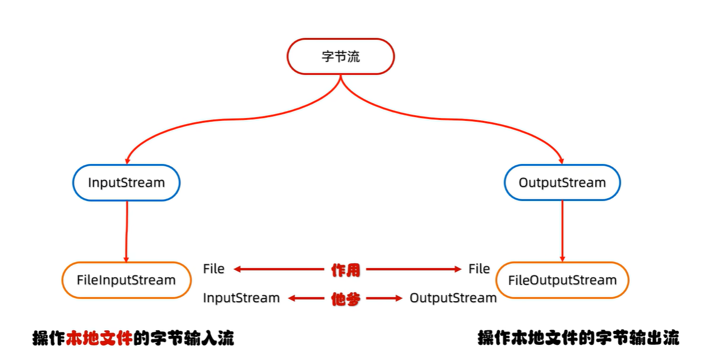
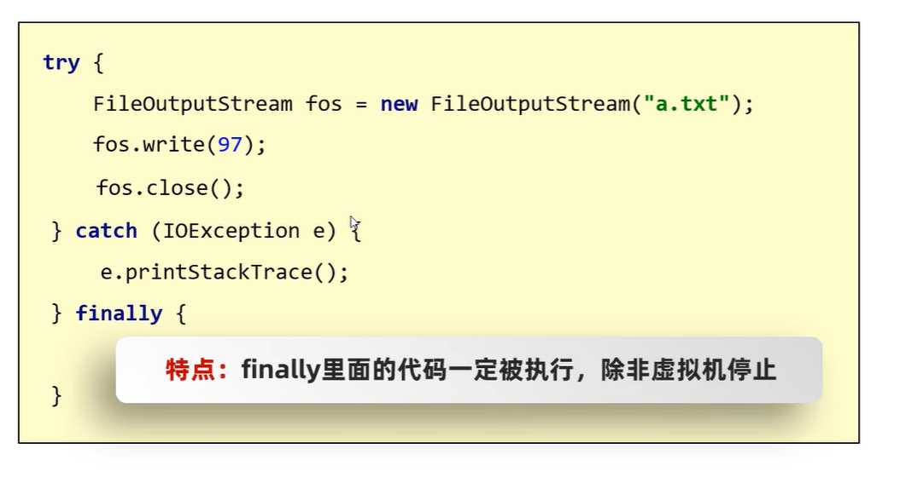
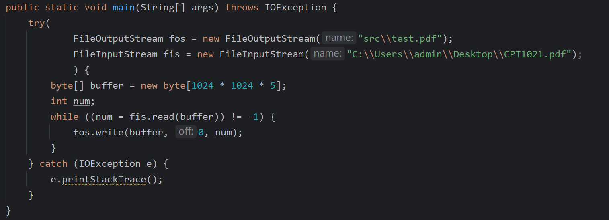
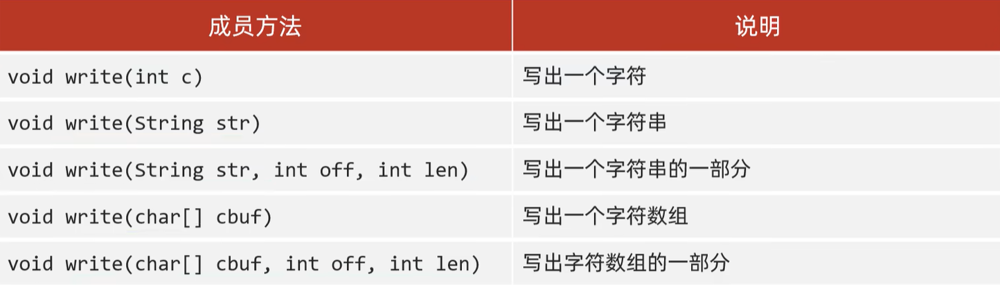
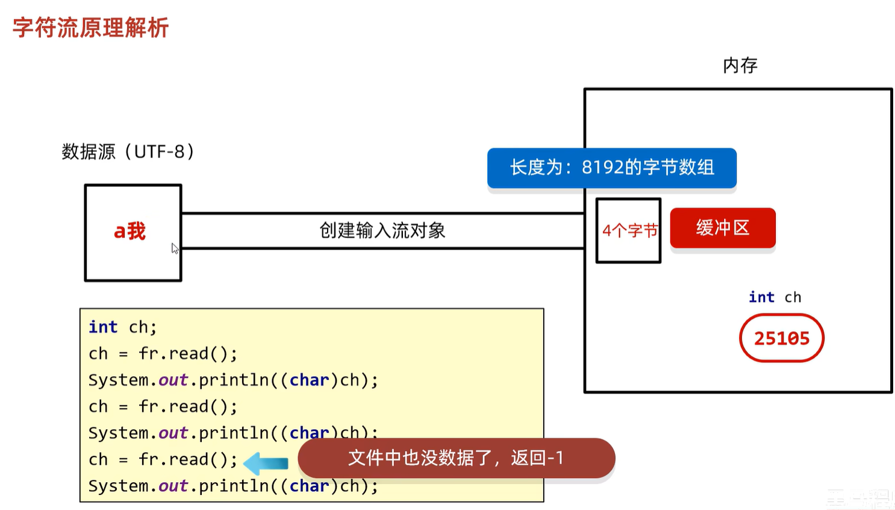
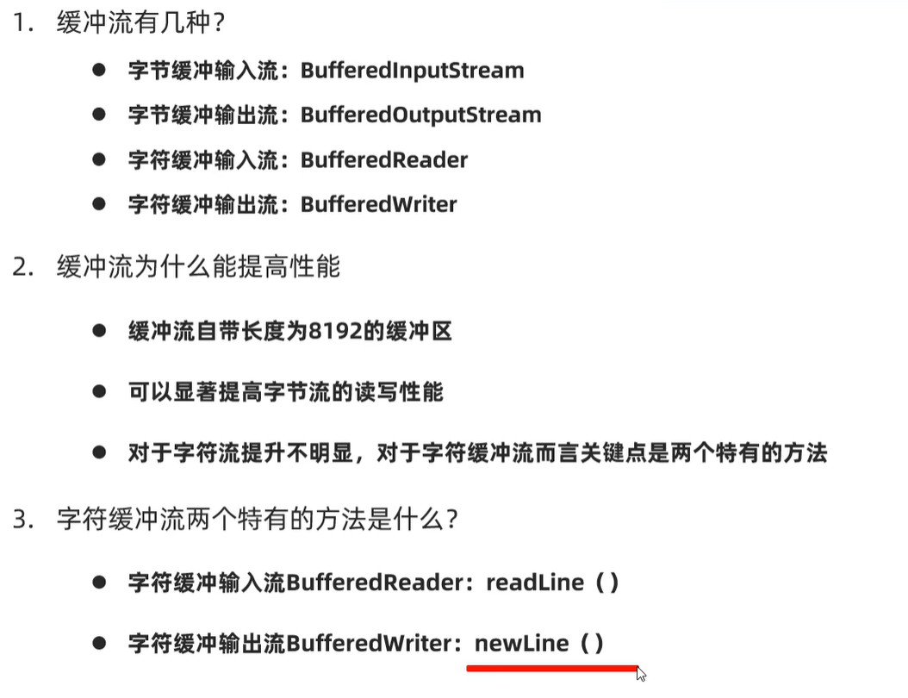

# IO

## [1] 什么是IO流

一种存取和读取数据的解决方案

IO 流，按照流的方向可以分为两类：输入流和输出流

按照操作文件的类型可以分为**字节流（可以操作所有文件）和字符流（只能操作纯文本文件）**


对于字节流和字符流而言，都有输入和输出类，而且是抽象类


那么抽象类的具体实现类是什么呢？如下图，是`FileInputStream` 和 `FileOutputStream`



## [2] 字节(输出)流 FileOutputStream

字节（Byte）输出流

```java
public static void main(String[] args) throws IOException {
    FileOutputStream fos = new FileOutputStream("a.txt"); // 创建对象
    fos.write(97); // ASCII码'a'，文件里面就这个字符
    fos.close(); // 释放资源，非常重要！
}
```

对于传入参数，是字符串，或者`File`对象，都可以！如果文件不存在就会创建一个新的，但是要保证父级路径存在。

**==这个方法会覆盖原始数据！==**

**具体来说，当这个对象创建的时候会判断父级路径下有没有这个文件，如果没有就创建，如果有就清空。**

最后的`close`是释放资源，如果不释放，别的程序就无法访问（上锁了）。但是一次写一个字节的数据太麻烦了，我希望一次性写多个，怎么办呢？

以下是写入数据的三种方式：


其中 `write(bytep[] b, int off, int len)`中的off指的是下标，len 指的是往后写多少个数据。

```java
public static void main(String[] args) throws IOException {
    FileOutputStream fos = new FileOutputStream("src\\1output.txt");
    String string = "这是一个字符串数据";
    fos.write(string.getBytes(StandardCharsets.UTF_8));
    fos.close();
}
```


**换行和续写**

换行：
	windows: `\r\n`
	Linux: `\n`
	Mac: `\r`

细节：
	在windows操作系统当中，java对回车换行进行了优化。
	虽然完整的是``\r\n``，但是我们写其中一个``\r``或者``\n``，
	Java也可以实现换行，因为Java在底层会补全。

建议：
	不要省略，还是写全了。 

```java
public static void main(String[] args) throws IOException {
    FileOutputStream fos = new FileOutputStream("src\\1output.txt");
    String string = "这是一个字符串数据\r\n这是一个字符串";
    fos.write(string.getBytes(StandardCharsets.UTF_8));
    fos.close();
}
```

续写：


```Java
public static void main(String[] args) throws IOException {
    FileOutputStream fos = new FileOutputStream("src\\1output.txt",true);
    String string = "这是一个字符串数据\r\n这是一个字符串";
    fos.write(string.getBytes(StandardCharsets.UTF_8));
    fos.close();
}
```

## [3] 字节(输入)流FileInputStream

和 `FileOutputStream` 一模一样，使用`.read()`方法读取1个字节的数据。如果后面没有数据了，就返回`-1`，否则返回当前数据的ASCII码。


如果文件不存在，直接报错。

当然可以边度边写，但是要保证，谁先创建对象，谁最后关闭`.close()`，也就是类似栈一样的。

但是用 `FileInputStream` 和 `FileOutputStream` 拷贝文件只适用于小文件，速度很慢...

慢的原因是`read()`方法一次只读取1个Byte，所以我们可以尝试用数组的方法来优化！

理论而言，数组越大拷贝越快。但是数组也是要占用空间的。一般数组长度为1024的整数倍。可以创建一个`1024*1024*5` (5MB)左右的数组！


1字节/次读取 7MB左右大小的文件，耗时：

```
[Time = 47.626 s]
```

1024 \* 1024 \* 5 (5MB) /次 读取7MB左右大小文件，耗时：

```
[Time = 0.016 s]
```

## [4] try-catch异常

如果当前write出了异常，然后直接被catch了，`fos.close()`这行代码就执行不到了！


因此，try-catch异常的完整代码如下：



finally 代码一定会被执行，除非虚拟机停止。


选中代码，Ctrl+Alt+T选择`try/catch/finally`

然后把`.close()`都放在finally中


此时会报错，因为局部变量的问题。但是因为fis和fos的创建对象也可能产生异常，不能放在try的括号外，因此我们可以使用这种结构：


先创建`null`，然后再在try里面new对象。

```java
FileOutputStream fos = null;
        FileInputStream fis = null;
        try {
            fos = new FileOutputStream("src\\test.pdf");
            fis = new FileInputStream("C:\\Users\\admin\\Desktop\\CPT1021.pdf");
            byte[] buffer = new byte[1024 * 1024 * 5];
            int num;
            while ((num = fis.read(buffer)) != -1) {
                fos.write(buffer, 0, num);
            }
        } catch (IOException e) {
            e.printStackTrace();
        } finally {
            if(fis!=null)
            {
                try {
                    fis.close();
                } catch (IOException e) {
                    throw new RuntimeException(e);
                }
            }
            if(fos!=null)
                try {
                    fos.close();
                } catch (IOException e) {
                    throw new RuntimeException(e);
                }
        }
```

但是这段代码太复杂了...有什么简化方案吗？有的。


中要注意点：只有实现了AutoCloseable接口的类才能这样写。

JDK 7 的写法（了解）：



因为创建对象都写在try里面，比较难阅读。因此，在JDK9可以这样写：


## [5] 中文乱码问题

如果我们尝试：

```java
public static void main(String[] args) throws IOException {
    FileInputStream fis = new FileInputStream("a.txt");
    int b = -1;
    while ((b = fis.read()) != -1) {
        System.out.print((char) b);
    }
}
```

其中`a.txt`中是：

```
你好
```

 那么其输出将会是

```
你好
```

### ASCII 字符集

记录了128个数据据，0~127，对于大多数欧洲国家够用了。因为ASCII字符集使用1Byte存储的。但是因为只有128位（7bit），还差1 bit，因此前面直接补0即可。


### GB、BIG5、GBK和Unicode的关系


GB2312在1980年发布，1981年5月1日正式实施，是简体中文汉字国家标准，收录7445个图形字符，包含6736个简体汉字。

由于GB2312没有繁体字，因此台湾地区推出了BIG-5字符集，收录13053个中文字体，1984年实施。

为了统一GB2312和BIG5，2020年3月17日退出GBK字符集（GB扩展），收录21003个汉字。

包含国家标准GB13000-1中的全部中日韩三国汉字以及BIG5编码中的所有汉字。


为了在世界大多数国家统一编码，国际标准字符集产生了，Unicode（也叫做万国码）。

### GBK 详解

GBK 采用2Byte存储。分为高位字节、低位字节。高位字节二进制一定是以 1 开头的。因为GBK兼容ASCII，对于ASCII而言，以及低位第1位补0，无高位，为了区分英文和中文，对于GBK而言如果要记录中文，采用2Byte的存储，高位字节第一位用1开头。例如：

```java
10111010 10111010 01100001
```

显然，有1个中文1个英文。


### Unicode 详解

**Unicode**：万国码

**研发方**：统一码联盟（也叫Unicode组织）

**总部位置**：美国加州

**研发时间**：1990年

**发布时间**：1994年发布1.0版本，期间不断添加新的文字，最新的版本是2022年9月13日发布的15.0版本。

**联盟组成**：世界各地主要的电脑制造商、软件开发商、数据库开发商、政府部门、研究机构、国际机构、及个人组成 

==**UTF-16编码规则如下**==

UTF全称 Unicode Transfer Format，用2~4 Byte保存数据，其中16 指的是16bit（2Byte）

==**UTF-32编码规则如下**==

采用32bit（4字节）保存

但是这样会浪费空间，例如ASCII只需要1 byte，用UFT-32就很浪费空间（浪费了3byte）。

因此，对于不同的文字，可以采用不同长度字节编码：


==**UTF-8编码规则如下**==


UTF-8不是字符集，是Unicode字符集的**一种编码方式**！


### 解释乱码

原因1：读取数据的时候没读完整个汉字。例如如下是用UTF-8编码的：


### 如何不产生乱码

不要用字节流读取文本文件。编码和解码要用同一个码表和编解码方式。

疑问：为什么字节流读取中文会乱码，但是字节流拷贝不会呢？显然，因为数据没丢失，记事本打开，记事本本身用的编码一致，所以就不会乱码

## [6] Java 中的编码格式


其中 IDEA 用的默认编码是 UTF-8

```Java
public static void main(String[] args) throws IOException {
    String str = "ni好啊";
    System.out.println(Arrays.toString(str.getBytes()));
}
```

UTF-8 默认是英文1字节，中文3字节，因此，总共八个字节数据：

```sql
[110, 105, -27, -91, -67, -27, -107, -118]
```

当然也可以指定为 GBK

```java
public static void main(String[] args) throws IOException {
    String str = "ni好啊";
    System.out.println(Arrays.toString(str.getBytes("GBK")));
}
```

GBK 是英文1字节，中文2字节

```sql
[110, 105, -70, -61, -80, -95]
```


演示错误解码：

```java
public static void main(String[] args) throws IOException {
    String str = "ni好啊";
    byte[] encode = str.getBytes(StandardCharsets.UTF_8);
    System.out.println("用UTF-8的编码结果是："+Arrays.toString(encode));
    String wrongDecode = new String(encode, "GBK");
    System.out.println("用GBK错误解码的结果是："+wrongDecode);
}
```

```sql
用UTF-8的编码结果是：[110, 105, -27, -91, -67, -27, -107, -118]
用GBK错误解码的结果是：ni濂藉晩
```


## [7] 字符流 FileReader/ FileWriter

**字符输入流** 

字符流在遇到英文的时候，只读取1字节，而遇到中文的时候一次读取多个字节（可以是GBK或者UTF-8）因此：

字符流 = 字节流 + 标准字符集

其输入、输出都符合这个规则，因此适合操作于纯文本文件。


| 操作类型           | 方法签名                             | 说明                         | 细节                                                         |
| ------------------ | ------------------------------------ | ---------------------------- | ------------------------------------------------------------ |
| 创建字符输入流对象 | `public FileReader(File file)`       | 创建字符输入流关联本地文件   | 如果文件不存在，就直接报错                                   |
| 创建字符输入流对象 | `public FileReader(String pathname)` | 创建字符输入流关联本地文件   | 如果文件不存在，就直接报错                                   |
| 读取数据           | `public int read()`                  | 读取数据，读到末尾返回-1     | 按字节进行读取，遇到中文，一次读多个字节，读取后解码，返回一个整数；读到文件末尾，`read`方法返回-1 |
| 读取数据           | `public int read(char[] buffer)`     | 读取多个数据，读到末尾返回-1 | 按字节进行读取，遇到中文，一次读多个字节，读取后解码，返回一个整数；读到文件末尾，`read`方法返回-1 |
| 释放资源           | `public int close()`                 | 释放资源/关流                | 无                                                           |

### 空参 .read 方法

```java
//1.创建对象并关联本地文件
FileReader fr = new FileReader("a.txt");
//2.读取数据 read()
//字符流的底层也是字节流，默认也是一个字节一个字节的读取的。
//如果遇到中文就会一次读取多个，GBK一次读两个字节，UTF-8一次读三个字节
int ch;
while ((ch = fr.read()) != -1) {
    System.out.print(ch);
}
//3.释放资源
fr.close();
```

```java
[a.txt]
你好，测试
```

输出如下：

```sql
20320 22909 65292 27979 35797 
```

为什么是数字？？因为：

1. `read()`默认一次读取1个字节，如果读取到中文之类的不止一个字节， 那么他就一次读取多个
2. 在读取之后，方法的底层还是会进行**解码**==并转为十进制==
3. 最后会把这个十进制作为返回值。比如英文的`a`对应是97，中文的你对应的是20320
4. 所以如果要看到文本，就需要进行强转。


所以只需要：

```java
System.out.print((char)ch+" ");
```

就行了。

### 带参 .read 方法

当然也可以用``char[]``读入，如下：

```java
public static void main(String[] args) throws IOException {
        FileReader fr = new FileReader("a.txt");
        char[] chars = new char[1];
        int length = 0;
        while ((length = fr.read(chars)) != -1) {
            System.out.print(new String(chars,0,length));
        }
        fr.close();
    }
```


```sql
[输出]
你好，测试，这是一个文本
```

但是如果多行读取的话，每一行的结尾实际上都有两个特殊字符，`\r\n`，

如果我们的文本和代码如下：

```java
public static void main(String[] args) throws IOException {
    FileReader fr = new FileReader("a.txt");
    char[] chars = new char[2];
    int length = 0;
    while ((length = fr.read(chars)) != -1) {
        System.out.println(new String(chars, 0, length));
    }
    fr.close();
}
```

```sql
你好，测试
这是一个文本
```

那么实际上这个文本是：

```sql
你好，测试\r\n
这是一个文本\r\n
```

所以一次读取两个char换行的话，其输出应该是这样的：

```java
你好
，测
试

这
是一
个文
本
```

也就是：

```sql
你好[print换行]，测 [print换行]试\r [print换行]\n这 [print换行]是一 [print换行]个文 [print换行]本
```

接下来转为对应文字就是上面的输出了。


注意空参的时候是只返回十进制，需要手动强转，而带参的read方法（也就是数组）是自动把十进制转为对应的具体的字符后返回给那个char数组的。这两者有区别要注意。 

### .write 方法


其中写出方法也有很多



还记得之前的 FileOutputStream 吗？==字节输出流==，只能输出1个字节数据，如果我们传入UTF-8的某个中文的十进制，他只能读取前1个字节：

```java
FileOutputStream fos = new FileOutputStream("output.txt");
fos.write(25105);
fos.close();
```

输出：


会产生乱码：````

但是如果我们使用**==字符输出流==**：那么就可以正常输出：

```java
FileWriter fw = new FileWriter("output.txt");
fw.write(25105);
fw.close();
```

```sql
[输出]
我
```


## [8] 字符输入、输出流底层原理

### 字符输入流

**[这集](https://www.bilibili.com/video/BV1yW4y1Y7Ms?p=93)** 中讲到**字==符==输入流** 的底层原理，实际上简而言之：每次创建对象都会创建一个8192 byte的缓冲区（在内存中）。

1. 如果缓冲无数据了，那么就从外存读取8192 byte到内存
2. 如果缓冲区还有数据，那么`read`方法会从缓冲区读取数据
3. 如果缓冲区没数据了，外存也到头了，那么就返回-1



> [!CAUTION]
>
>  这里说的是字**符**输入流，不是字节输入流。字节输入流**没有缓冲区**
>

可以通过debugger中的`bb`变量验证，确实是8192字节缓冲区。

小测试：

```java
public static void main(String[] args) throws IOException {
    FileReader fr = new FileReader("output.txt");
    char[] buffer = new char[8192];
    fr.read(buffer);// 8192个字节读取到缓冲区（内存）
    FileWriter fw = new FileWriter("output.txt"); // 会清空文件（清空外存）
    fw.close();
    fr.close();
    System.out.println(Arrays.toString(buffer));
}
```

这个buffer因为是在内存中的，所以实际上还是能输出的。

### 字符输出流

同样的，字节输出流是没有缓冲区的，直接写到外存的。但是字符输出流有缓冲区。


以下3种方法会真正写道目的地（外存）：

1. 缓冲区满了（最常见）。
2. 手动使用`flush()`刷新命令，刷新后缓冲区写入外存，然后重置为0，还能重新写。
3. 当流被`.close()`的时候，写到外存之后就不允许再往缓冲区写东西了。

## [9] 综合IO练习

### 简单拷贝文件

```java
public static void copyFile(File sourceFile, File targetFile) throws IOException {
        targetFile.mkdirs();
        File[] subFile = sourceFile.listFiles(); // 先获取sourceFile下的所有子文件
        for(File file:subFile){
            if(file.isDirectory()){
                // 如果这是个文件夹，那么递归，目的地变为targetFile下的
                copyFile(file, new File(targetFile,file.getName()));
            }else{
                // 如果这是个文件，直接写出
                FileInputStream fis = new FileInputStream(file);
                FileOutputStream fos = new FileOutputStream(new File(targetFile,file.getName()));
                byte[] buffer = new byte[1024*512];
                int status = 0;
                while((status = fis.read(buffer)) != -1){
                    fos.write(buffer,0,status);
                }
                fos.close();
                fis.close();
            }
        }
    }
```

### 简单加密、解密文件

使用异或`^`加密、解密文件；异或是：两边相同为`false`，两边不同为`true`

如果是十进制数的话就变为二进制进行异或。


100 ^ 10 = 110 而 110 ^ 10 = 100能还原

```java
public static void encryptAndDecryptFile(File sourceFile, File targetFile, byte[] key) throws IOException {
        if(sourceFile.getAbsolutePath().equals(targetFile.getAbsolutePath()))
            return;
        if(sourceFile.isDirectory() || targetFile.isDirectory())
            return;
        FileInputStream fis = new FileInputStream(sourceFile);
        FileOutputStream fos = new FileOutputStream(targetFile);
        byte[] buffer = new byte[Math.min(key.length*256,1024)];
        int status = -1;
        while((status = fis.read(buffer)) != -1){
            for(int i = 0; i<status;i++)
                buffer[i] = (byte) (key[i%key.length]^buffer[i]);
            fos.write(buffer,0,status);
        }
        fos.close();
        fis.close();
    }
```


### BOM头

BOM头文件（.txt文件前多了3字节储存编码格式，IDEA默认无BOM头，Windows右键另存为请选择无BOM头的UTF-8）


## [10] 高级流

之前学到了四种流


现在，高级流种会解决基本流效率较慢的问题，比如缓冲流$——$通过引入缓冲 Buffer


### 字节缓冲流 BufferedInputStream/ BufferedOutputStream


先前提到，==字节缓冲流是**没有缓冲区的**==，这会导致读写速度非常低效。因此，Buffered字节缓冲流就添加了大小为8192字节的缓冲区。


```java
BufferedInputStream bis = new BufferedInputStream(new FileInputStream("test.txt"));
BufferedOutputStream bos = new BufferedOutputStream(new FileOutputStream("test2.txt"));
```

这两个类传参必须基于他们所包装的基本流：`FileInputStream`和`FileOutputStream`

关闭只需要`bis.close()`和`bos.close`即可，其所包装的基本流不需要关闭（底层帮忙关闭了）


这个流可以指定缓冲区大小。


如果是数组：


### 字符缓冲流 BufferedReader/ BufferedWriter (推荐)


`readLine()`方法会读取到回车换行结束，但是**不会把**回车换行读取到内存中。

当读取到末尾就返回`null`

> [!CAUTION]
>
> 缓冲流（字节缓冲流、字符缓冲流）自带长度为8192的缓冲区。
>
> ==字**节**缓冲流==长度为8192的缓冲区是 Byte类型的（Byte数组），因此是 8KB
>
> ==字**符**缓冲流==长度为8192的缓冲区是Char类型的（Char数组），因此是 16KB



### 转换流（JDK 11 后已淘汰） InputStreamReader/ InputStreamWriter

转换流属于字符流的一种，属于高级流


为什么说转换流是字符流？实际上转换流是对字节流的包装，能够一次读取多个字节并且不会乱码。

接下来输出就是包装字节流输出。


那么转换流有什么作用呢？字节流想要使用字符流中的方法。IDEA默认使用UTF-8的读取和输出，那么如果有一个GBK编码的文件，就不能用默认方法了。


实际上，我们用转换流就是为了希望能够手动指定编码格式，我们要用`InputStreamReader`写**但是这种方法在JDK11被淘汰了**，因为转换流的创建过于麻烦。在后续的JDK版本中，**可使用字符流直接指定字符集！**

```java
FileReader fr = new FileReader("a.txt");
char[] buf = new char[100];
int len = fr.read(buf);
while (len != -1) {
    System.out.print(new String(buf, 0, len));
    len = fr.read(buf);
}
fr.close();
```

如果`a.txt`是GBK编码，那么输出：

```text
������
����һ���ı�
```

但是如果指定GBK编码

```java
FileReader fr = new FileReader("a.txt",Charset.forName("GBK"));
char[] buf = new char[100];
int len = fr.read(buf);
while (len != -1) {
    System.out.print(new String(buf, 0, len));
    len = fr.read(buf);
}
fr.close();
```


那么输出：

```java
你好，测试
这是一个文本
```


好了，现在能够读取数据，如何写出数据呢？我们希望写出数据的时候也是按照指定的写，例如写成GBK而不是UFT-8（默认）。

因此，我们要用`OutputStreamWriter`写，但是其也被淘汰了，现在`FileWriter`就可以做到。

```java
FileWriter fr = new FileWriter("a.txt",Charset.forName("GBK"));
String str = "测试1\r\n测试2\r\n";
fr.write(str);
fr.close();
```


## [11] 总结

先前讲到 字节流（`FileIInputStream`和`FileOutputStream`）是基于**1字节/次**的，读取写出很慢。

但是字节流能使用**数组**来加速！

同时，我们也讲到了字符流(`FileReader`和`FileWriter`)，字节流则是通过对字节进行判断读取的（不会乱码），输出也是很慢的。

但是字符流也能使用**数组**来加速！


那么后来，我们又引入了字节缓冲流`BufferedInputStream`和`BufferedOutputStream`

以及字节缓冲流`BufferedReader`和`BufferedWriter`。他们都加入了缓冲区（是高级流）。

之前说过，字节流是没有缓冲区的，但是字符流有。因此`BufferedReader`和`BufferedWriter`效率提升不明显。

---

`FileIInputStream`和`FileOutputStream` $——加了缓冲区——$`BufferedInputStream`和`BufferedOutputStream`

`FileReader`和`FileWriter`$——加了缓冲区但是效率提升不明显——$`BufferedReader`和`BufferedWriter`

---

**用 `BufferedReader` 主要是用他的`readLine`功能**

如果需要拷贝文件，可以使用 `BufferedInputStream`和`BufferedOutputStream`

但是，对于指定文件类型，我们要用 `FileReader`，但是Buffered-前缀的是无法指定的。

但是Buffered的本质上还是要传入`FileReader`因此我们可以这样操作：

```java
BufferedReader br = new BufferedReader(new FileReader("a.txt",Charset.forName("GBK")));
String s = br.readLine();
while (s != null) {
    System.out.println(s);
    s = br.readLine();
}
br.close();
```

这样就可以读取一行并且指定GBK了

## [12] 序列化流和反序列化流

他们**仍然属于高级流**


反序列化流是输入的，而序列化流是输出的。他们属于字节流。

序列化流：能把对象写到文件中。当然，也可以直接写，但是这样会被修改或者被别人看懂。因此，可以直接写对象到文件，这样也有好处。


注意，写出的对象必须实现`Serializable`接口：


但是实际上`Serializable`接口是空的，没有抽象方法。这种接口叫做**==标记型接口==**。一旦实现了这个接口就代表这个类的对象能够被序列化。（类似于一个物品的合格证）


接下来，用反序列化流读取文件，生成为对象。使用`readObject()`读取。

当然，如果你写出一个对象到文件，更改这个对象类属性，再读取，就会报错：序列化UID不一致。

因为在Java底层当实现了序列化接口之后会根据成员变量、静态变量、构造方法、成员方法生成一个序列化UID。（Long类型的，当然也叫做版本号，这个版本号也会保存到本地的）

当然，在很多情况下，业务需求增大，必然导致类属性增减，这样版本号就不一样了。但是我们可以手动指定版本号。

1. 版本号要是`Long`类型
2. 必须是静态的（对象共享同一版本号）
3. 必须是`final`
4. 必须是private，并且不提供对外`get`和`set`方法
5. 变量名只能是 `serialVersionUID`

```java
private static final long serialVersionUID = 1L;
```

在IDEA中勾选上这两个设置：


这样IDEA就可以自动根据你的类设置一个 `serialVersionUID` 了！

```java
@Serial
private static final long serialVersionUID = 4581783036909252131L;
```

对于相同的UID，Java会自动赋值，有的属性就给，没有的就是默认值。

对于那些你不希望序列化的变量（属性），**==可以在前面加入`transient`关键字，也叫做瞬态关键字==**

> 这个单词Transient的意思是：短暂的、暂时的


当然，反序列化、序列化可以对多个对象操作。但是如果读取对象个数>写入对象个数，那么就会输出`EOFException`也就是End of file exception。那么如何正确操作呢？一般，我们会存多个对象到一个ArrayList里面，然后存储ArrayList对象。


## [13] 打印流


字节打印流：`PrintStream`

字符打印流：`PrintWriter`

### 字节打印流


字节流底层没有缓冲区，开不开自动刷新都一样


### 字符打印流


字符流底层有缓冲区，想要自动刷新需要开启


记得构造方法中有`autoFlush`方法，请设为`true`以保证能自动刷新、保证能写到本地。

# 解压缩流

仅`.zip`

解压：

```java
public static void unZip(String zipFile, String destDir) throws Exception {
        ZipInputStream zipInputStream = new ZipInputStream(new FileInputStream(zipFile));
        ZipEntry nextEntry;
        while ((nextEntry = zipInputStream.getNextEntry()) != null) {
            if (nextEntry.isDirectory()) {
                File dir =  new File(destDir,nextEntry.getName());
                dir.mkdirs();
            }else{
                File  destFile = new File(destDir,nextEntry.getName());
                BufferedOutputStream bos = new BufferedOutputStream(new FileOutputStream(destFile));
                int len;
                byte[] buf = new byte[1024];
                while ((len = zipInputStream.read(buf)) != -1) {
                    bos.write(buf, 0, len);
                }
                bos.close();
                zipInputStream.closeEntry();
            }
        }
    }
```

压缩：

```java
    public static void zip(String fileOrDir, String destDir,String zipName) throws Exception {
        if(zipName==null||zipName.isEmpty()){
            zipName="zip.zip";
        }
        zipName = zipName.split("\\.",2)[0]+".zip";
        if(fileOrDir.endsWith("\\"))
            fileOrDir = fileOrDir.substring(0, fileOrDir.length() - 1);
        if(destDir.endsWith("\\"))
            destDir = destDir.substring(0, destDir.length() - 1);
        File dest = new File(destDir);
        if (!dest.exists()) return;
        if (dest.isDirectory()) {
            dest = new File(destDir, zipName);
        }
        ZipOutputStream zos = new ZipOutputStream(new FileOutputStream(dest));

        File f = new File(fileOrDir);
        if (!f.exists()) return;
        if (f.isDirectory()) {
            // 这个文件是 directory
            dir2zip(dest, fileOrDir, zos, f);
        } else {
            // 这个文件夹是 file
            file2zip(dest, fileOrDir, zos, f);
        }

        zos.close();
    }

    private static void dir2zip(File zipAbsoluteFile, String fromFile, ZipOutputStream zos, File f) throws Exception {
        if (f.listFiles().length == 0) {
            String name = f.getName()+"\\";
            zos.putNextEntry(new ZipEntry(name));
            zos.closeEntry();
            return;
        }
        for (File file : f.listFiles()) {
            if (file.isDirectory()) {
                if (file.listFiles().length == 0) {
                    String name = file.getAbsolutePath().replace(fromFile + "\\", "") + "\\";
                    zos.putNextEntry(new ZipEntry(name));
                    zos.closeEntry();
                    continue;
                }
                dir2zip(zipAbsoluteFile, fromFile, zos, file);
            } else {
                file2zip(zipAbsoluteFile, fromFile, zos, file);
            }
        }
    }

    private static void file2zip(File zipAbsoluteFile, String fromFile, ZipOutputStream zos, File f) throws Exception {
        if (zipAbsoluteFile.getAbsolutePath().equals(f.getAbsolutePath())) return;
        String name;
        name = f.getAbsolutePath().replace(fromFile + "\\", "");
        ZipEntry entry = new ZipEntry(name);
        zos.putNextEntry(entry);
        BufferedInputStream bis = new BufferedInputStream(new FileInputStream(f));
        int len;
        byte[] buf = new byte[1024];
        while ((len = bis.read(buf)) != -1) {
            zos.write(buf, 0, len);
        }
        bis.close();
        zos.closeEntry();
    }
```

# Commons-io

Apache 下的一个第三方jar，里面有 FileUtils等工具包

包括`Hutool` 也是第三方包，需要用lib操作。
