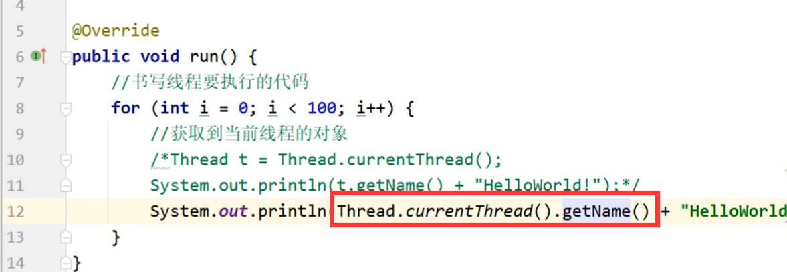
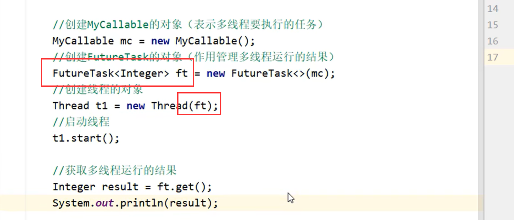
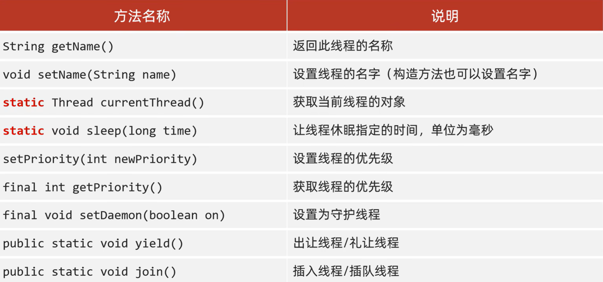
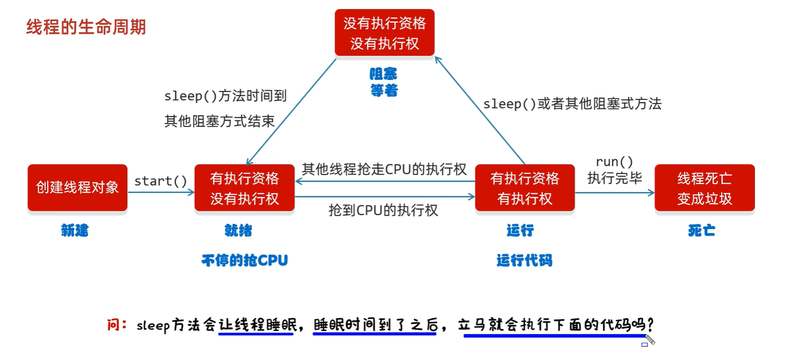

# 多线程

进程中包含线程（操作系统基础）。

并发：交替运行。

并行：同时运行。

2核4线程的CPU就是可以同时并行4个线程的。

## 多线程的实现方式

### 继承Thread类

继承后重写`run()`方法。

继承后有个`.getName()`和`setName()`方法可以获取线程的名字。

### 实现Runnable接口

`getName`方法是Thread类（父类）的方法，因此继承Thread类可以直接用这个方法。

但是Runnable接口并没有这个方法，所以还是要自己写。

那么，如果我的类只继承了 Runnable 接口，在外部类中使用

```java
Thread t = new Thread(mt);
// mt 是继承了Runnable类的一个对象
t.start();
```

那么如何获取到当前的thread呢？

实际上只需要使用

`Thread t = Thread.currentThread();`



### 利用Callable和Future接口方式实现

因为前两种方法没有返回值。

Callable是类。

Future是接口。FutureTask实现了Future接口。

1. 创建一个自己的MyCallable类继承Callable
2. 使用FutureTask管理线程的返回数据
3. 使用Thread创建线程。此处传参是传入FutureTask对象



## Thread中的常见成员方法



JAVA 中线程的优先级最小是1，最大是10。默认是5。优先级越大，越容易获取CPU。

默认线程名字 `Thread-X`其中X是数字，从0开始。

`Thread.currentThread()`如果在main函数中调用：

- 当JVM虚拟机启动之后，会自动的启动多条线程
- 其中有一条线程就叫做main线程
- 他的作用就是去调用main方法，并执行里面的代码
- 在以前，我们写的所有的代码，其实都是运行在main线程当中

JAVA中的线程是抢占式调度，通过`setPriority()`可以更改优先级，更改抢占的几率。优先级最低是1，最高是10。但是10的优先级不一定就是100%完全抢占，同样任务量的情况下也不一定先运行完毕。

对于守护线程的说法：

- 没有设置为守护线程的线程是**非守护线程**
- 通俗易懂地说：如果守护线程结束了，非守护线程就没有存在的必要了，就会立刻终止。
- 但是终止不是立刻的，因为虚拟机告诉守护线程也是需要很短的时间的。

`Thread.yield()`方法用于出让当前线程：当前线程主动礼让出CPU。但是出让的线程也有可能重新抢夺到CPU，因此只是尽可能出让。

`t.join()` 方法如下。在main线程中写这一条语句，那么这条语句后的所有执行都会等到`t`完成后才执行。

## 线程的生命周期



操作系统的三角裤模型。

使用Synchronized操作，再加一个全局锁 `Object lock = new Object`就能保证原子性。

## Synchronized 锁方法

1. Synchronized 同步方法锁住的是方法里面的所有代码
2. 锁对象不可自己指定
   1. 非静态：this
   2. 静态：当前类的字节码文件对象
