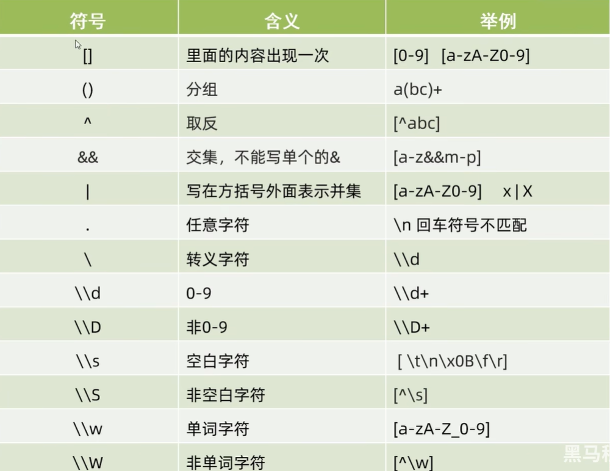

# 正则表达式


```java
// 字符类
String reg;
// 只能是括号里的字符，也就是a，b，c
reg = "[abc]";
// 除了括号里的字符，都行
reg = "[^abc]"; // a 不行； d可以
// 这两个reg是一样的效果
reg = "[a-zA-Z]";
reg = "[a-z[A-Z]]";
// 取交集
reg = "[a-z && [abc]]"; // 只能是abc。交集后的结果。

// 非交集
reg = "[a-z && [^abc]]" // 也就是a-z并![abc] 因此是d-z
reg = "[a-z && [^a-y]]" // 也就是a-z并！[a-y]因此是 z

// 练习
"a".matches("[abc]"); // true
"ab".matches("[abc]"); // false
"ab".matches("[abc][abc]"); // true

System.out.println("i".matches("[  [a-c]  [d-f]  [g-i]  ]")); // true

System.out.println("&".matches("[a-z&[0123]]")); // True，这里的&仅仅代表'&'
System.out.println("&".matches("[a-z && [def]]")); // False
System.out.println("e".matches("[a-z && [def]]")); // True

// 特殊例子
System.out.println("\\".matches("[\\\\]")); // True
System.out.println("|".matches("\\|")); // True
```


```java
// . 代表任意字符
System.out.println("你好".matches(".")); // False
System.out.println("你好".matches("..")); // True
System.out.println("123".matches(".{3}||.{2}||.{1}")); // True
System.out.println("12".matches(".{3}||.{2}||.{1}")); // True
System.out.println("1".matches(".{3}||.{2}||.{1}")); // True
System.out.println("123".matches(".{3,}")); // >= 3 True
System.out.println("123456".matches(".{3,6}")); // >=3 && <= 6 True
System.out.println("Abc".matches("[A-Z]((?i)([a-z]))[A-Z]")); // 强制第一个第三个大写，中间忽略大小写
```

## [1] 总结




```java
import java.util.regex.*;

public class RegexExample {
    public static void main(String[] args) {
        // 输入字符串，包含多个日期
        String input = "The first date is 2025-01-15, and the second date is 2026-02-20.";

        // 正则表达式：匹配日期格式 yyyy-MM-dd
        String regex = "[0-9]{4}(-[0-9]{2}){2}";  // 捕获年、月、日

        // 创建 Pattern 对象
        Pattern pattern = Pattern.compile(regex);

        // 创建 Matcher 对象
        Matcher matcher = pattern.matcher(input);

        // 查找匹配的内容
        while (matcher.find()) {
            // 提取并打印年、月、日
            System.out.println("Result: " + matcher.group());
        }
    }
}

```

## [2] Pattern

```java
 String s = "Java1是一门面向对象的编程语言，不仅吸收了C++语言的各种优点，还摒弃了C++里难以理解的多继承、指针等概念，因此Java2语言具有功能强大和简单易用两个特征。";
        Pattern p = Pattern.compile("Java[0-9]{0,2}");
        Matcher m = p.matcher(s);

        boolean b = m.find();
        if(b) System.out.println(m.group()); // java1

        b = m.find();
        if(b) System.out.println(m.group()); // java2
```

在这里，每次调用`m.find()`都会寻找一次。找到的话，就记录`[0,4+1]`（以第一个为例）

为什么是`[0,4+1]`而不是`[0,4]`？因为`substring()`包头不包尾。


## [3] 带条件的正则表达式


```java
String text = "Java1,Java2,Java3,Java12,JAVA13,jaVA14";
String reg1 = "((?i)Java)(?=[0-9]{2})";
String reg3 = "((?i)Java)(?:[0-9]{2})";
String reg4 = "((?i)Java)(?![0-9]{2})([0-9]{1,})";
```

```reg2
// reg1
Java
JAVA
jaVA
```

```reg1
// reg3
Java12
JAVA13
jaVA14
```

```reg4
// reg4
Java1
Java2
Java3
```

## [4] 贪婪爬取和非贪婪爬取

```java
String text = "abbbb";
String reg1 = "ab+"; // 贪婪爬取
String reg2 = "ab+?"; // 非贪婪爬取
```

## [5] replaceAll和split方法

```java
String text = "学校手机号分别为：13988888888,13877777777,13600000000";
String reg1 = "[0-9]{11}";
String encoded = text.replaceAll(reg1, "***");
System.out.println(encoded);
```

```sout
学校手机号分别为：***,***,***
```


```java
String text = "学校手机号分别为：13988888888,13877777777,13600000000";
String reg1 = ",";

String[] encoded = text.split(reg1);
for (int i = 0; i < encoded.length; i++) {
    System.out.println(encoded[i]);
}
```

```java
学校手机号分别为：13988888888
13877777777
13600000000
```


```java
String text = "学校手机号分别为：13988888888,13877777777,13600000000";
        String reg1 = ",";

        String[] encoded = text.split(reg1);
        for (int i = 0; i < encoded.length; i++) {
            Pattern p = Pattern.compile("[0-9]{11}");
            Matcher m = p.matcher(encoded[i]);
            if(m.find()) {
                encoded[i] = m.group();
            }
        }
        for (int i = 0; i < encoded.length; i++) {
            System.out.println(encoded[i]);
        }
```

