# 常用API

## [1] Math 类

常用的方法

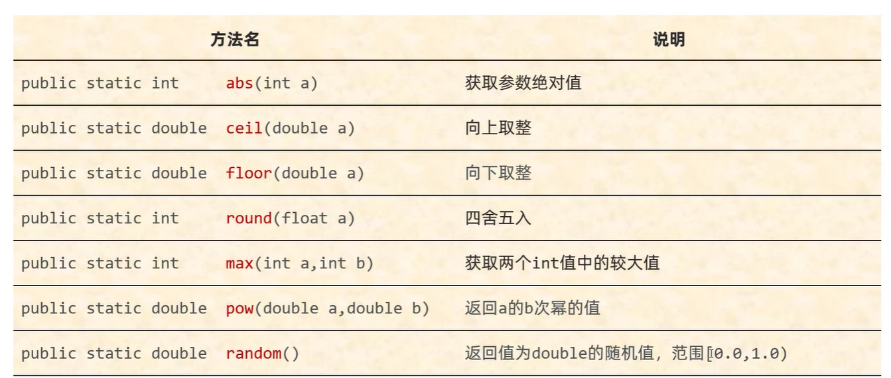

## [2] Runtime 类

常用的方法

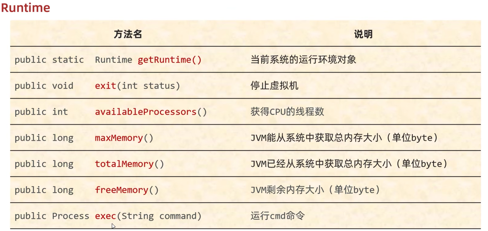

## [3] 重写 Object

1. equals方法
2. toString方法
3. clone方法

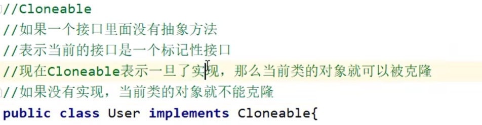

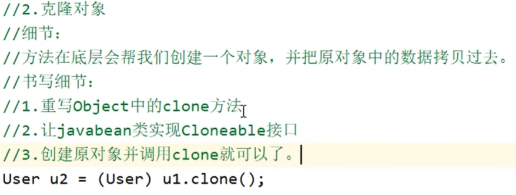

clone 导致的浅拷贝：

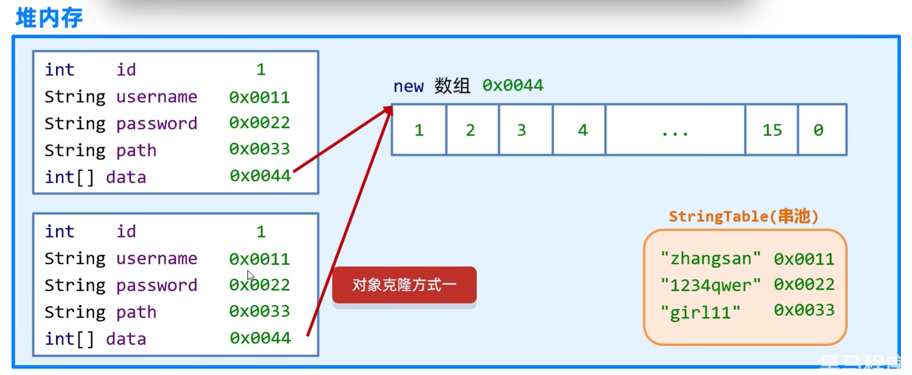

当然也有深克隆：


对于数组，会使用`new`，然而对于字符串`String`则会复用。

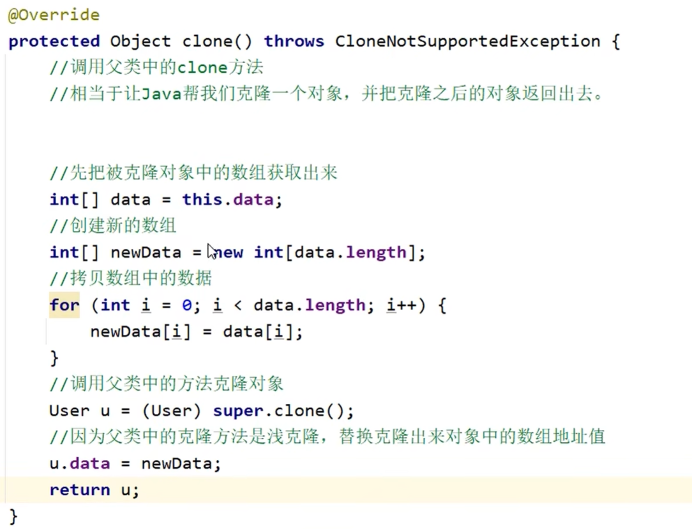

在主函数中


在以后的开发中，我们可能会用到第三方库`Gson`


## [4] Objects 类

在一般`@override equals`之后

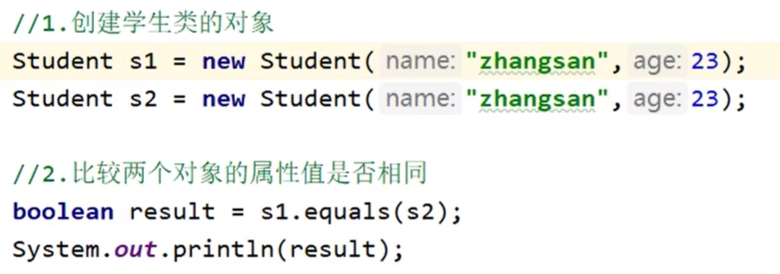

这样写并没有什么问题。但是如果`s1`的值为`null`

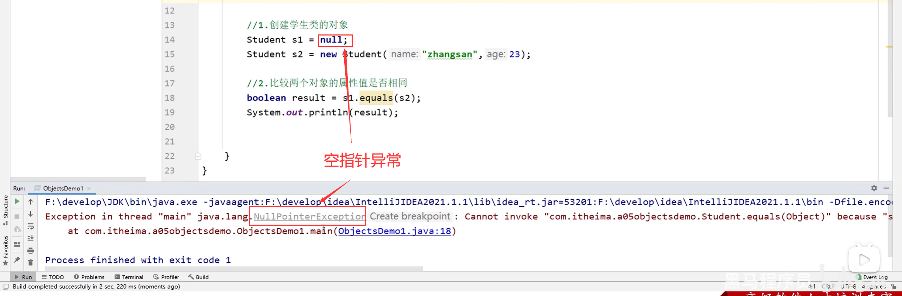

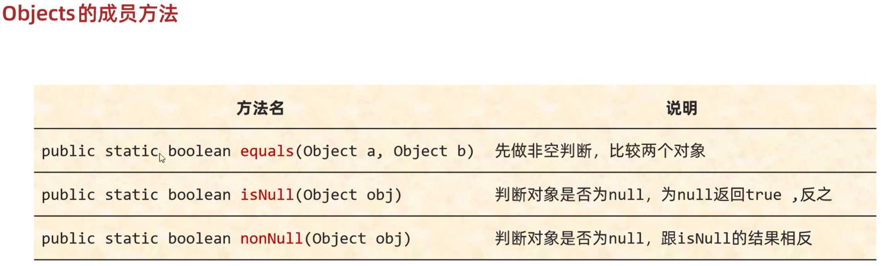

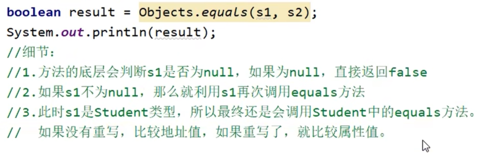

## [5] BigInteger 类


第3个`radix`是进制数，例如`new BigInteger("11011101",2)` 就代表是二进制数

其中`valueOf()` 是 `BigInteger`类的一个静态方法

小细节：对象一旦创建，值就不能改变。

```java
// 获取一个随机大整数
BigInteger bd1 = new BigInteger(4,new Random()); // 输出 [0,16-1]

// 获取一个指定的大整数
BigInteger bd2 = new BigInteger = new BigInteger("12356789098765456217893128734861278963897612783612");

// 获取指定进制的大整数
BigInteger bd3 = new BigInteger = new BigInteger("100",2); // 结果是4；这里必须和进制数吻合

// 静态方法获取 BigInteger
BigInteger bd4 = new BigInteger.valueOf(100);// 这里的ValueOf只能是Long范围的

// java已经创建好了 -16~16 的BigInteger对象，多次创建不会生成新的
BigInteger bd5 = new BigInteger.valueOf(16);
BigInteger bd6 = new BigInteger.valueOf(16);
System.out.println(bd5==bd6); // True

// 对象一旦创建，值就不允许被改变
BigInteger bd7 = new BigInteger.valueOf(1);
BigInteger bd8 = new BigInteger.valueOf(2);
BigInteger bd9 = bd7.add(bd8); // bd9 != bd8 || bd7
```


方法：

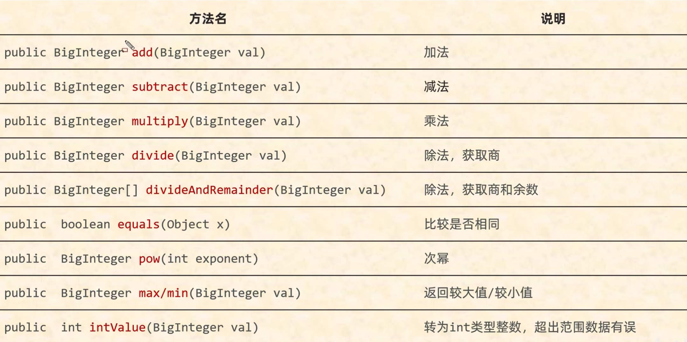

```java
// 加法
        BigInteger bd1 = new BigInteger("10");
        BigInteger bd2 = new BigInteger("3");
        BigInteger bd3 = bd1.add(bd2);
        System.out.println(bd3);

        // 除法
        BigInteger[] arr = bd1.divideAndRemainder(bd2);
        System.out.println(arr[0]); // 结果
        System.out.println(arr[1]); // 余数

        // 次幂
        BigInteger bd4 = bd1.pow(100);
        System.out.println(bd4);

        // 较大较小值
        System.out.println(bd1.max(bd2));
        System.out.println(bd1.min(bd2));

        // 转为Int类型
        System.out.println(bd1.intValue());

        // 转为Long类型 或者 Float、Double 类型
        System.out.println(bd1.longValue());
        System.out.println(bd1.floatValue());
        System.out.println(bd1.doubleValue());
```


### BigInteger内部原理

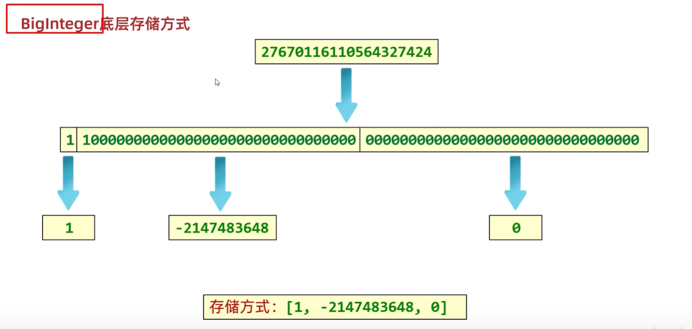

对于一个大数字，首先转为**二进制补码**后，以**32**位为一组，拆分成若干组。然后这些组转为`INT`类型，储存在数组中

数组最大长度是INT最大值`[2147483647]`，因此`BigInteger`有上限，但是很大。

## [6] BigDecimal 类

计算机中小数的不精确性

```java
//0.09999999999999999
//0.11599999999999999
//0.010000000000000002
System.out.println(0.09+0.01);
System.out.println(0.216-0.1);
System.out.println(0.1*0.1);
```


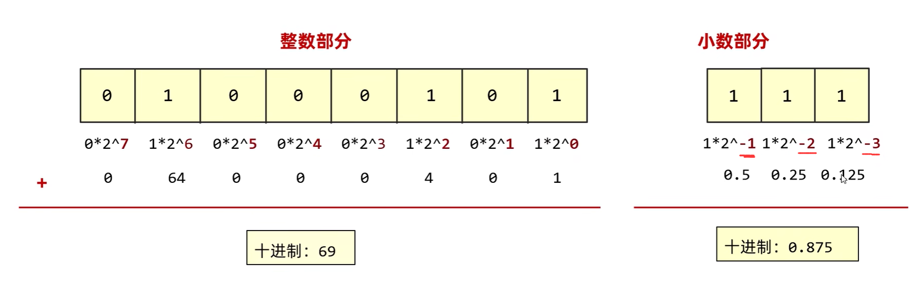

现在，我们关注小数点后的数字


可以发现，某些数字的小数部分二进制是很长的

然而，Java中的`float`和`double`留给小数部分是有限的，因此`0.226`要存入double的话，最后三位会被舍去。

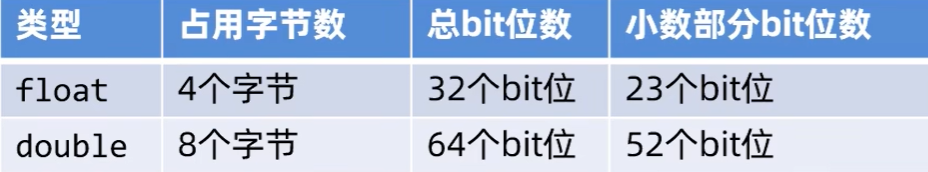

现在我们尝试使用`double`类型创建BigDecimal对象


```java
// 这种方式是不精确的，不建议使用
System.out.println(bd1);			// 0.01000000000000000020816681711721685132943093776702880859375
System.out.println(bd2);			// 0.0899999999999999966693309261245303787291049957275390625
System.out.println(bd1.add(bd2));	// 0.09999999999999999687749774324174723005853593349456787109375
```

可见用`double`来创建`BigDecimal`是不精确的

因此，我们一般传递**字符串**而不是`double`

```java
BigDecimal bd3 = new BigDecimal("0.01");
BigDecimal bd4 = new BigDecimal("0.09");
System.out.println(bd3);            // 0.01
System.out.println(bd4);            // 0.09
System.out.println(bd3.add(bd4));   // 0.10
```

节约内存：

```java
// 如果传递的是[0,10]的整数，那么就返回已存在的对象
BigDecimal bd5 = BigDecimal.valueOf(0);
BigDecimal bd6 = BigDecimal.valueOf(0);
System.out.println(bd5==bd6); // TRUE
```

加减乘法是一样的，不过除法我们这里说一下

这样写会报错

```java
BigDecimal bd7 = BigDecimal.valueOf(10);
BigDecimal bd8 = BigDecimal.valueOf(3);
System.out.println(bd7.divide(bd8));
```
```
Exception in thread "main" java.lang.ArithmeticException: Non-terminating decimal expansion; no exact representable decimal result.
	at java.base/java.math.BigDecimal.divide(BigDecimal.java:1804)
	at test.main(test.java:32)
```

因为这里除不尽

```java
 BigDecimal bd7 = BigDecimal.valueOf(10);
 BigDecimal bd8 = BigDecimal.valueOf(3);
 System.out.println(bd7.divide(bd8,5, RoundingMode.CEILING));// 3.33334
```


有很多的`RoundingMode`可供选择


储存模式

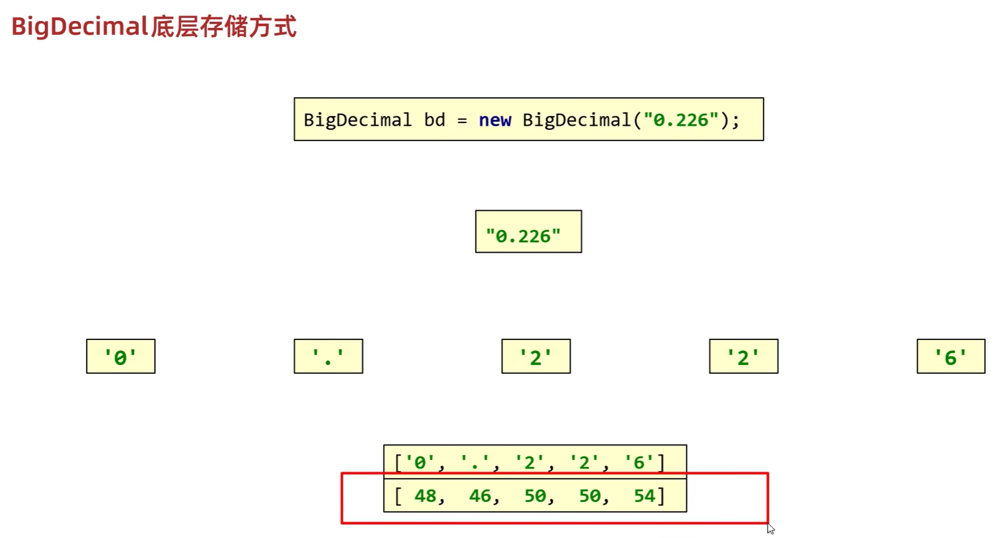

`BigDecimal`使用了`ASCII`码的方式进行储存，存到一个数组。

## [7] JDK7时间类

世界标准时间：格林尼治时间（英国）（GreenWich Mean Time GMT）。（有误差）

现在的标准时间：原子钟。用铯原子的震动频率来算。UTC。

### Date类

JDK7之前的，时间。精确到毫秒。

```java
// 如何创建日期对象？
Date date = new Date();
Date date = new Date(指定毫秒值);
// 如何修改时间对象中的毫秒值
setTime(毫秒值);
// 如何获取时间对象中的毫秒值
getTime();
```


### SimpleDateFormat

JDK7之前的，格式化时间。

| 构造方法                                  | 说明                                       |
| ----------------------------------------- | ------------------------------------------ |
| `public SimpleDateFormat()`               | 构造一个`SimpleDateFormat`，使用默认格式   |
| `public SimpleDateFormat(String pattern)` | 构造一个`SimpleDateFormat`，使用指定的格式 |


| 常用方法                                | 说明                         |
| --------------------------------------- | ---------------------------- |
| `public final String format(Date date)` | 格式化（日期对象 -> 字符串） |
| `public Date parse(String source)`      | 解析（字符串 -> 日期对象）   |

简单的部分：

| 字符 | 说明 | 示例1 | 示例2                   |
| ---- | ---- | ----- | ----------------------- |
| y    | 年   | 2023  | 2023年                  |
| M    | 月   | 11    | 11月                    |
| d    | 日   | 11    | 11日                    |
| H    | 时   | 13    | 13:27:06                |
| m    | 分   | 27    | 2023年11月11日 13:27:06 |
| s    | 秒   | 06    | yyyy-MM-dd HH:mm:ss     |

```java
public static void main(String[] args) throws ParseException {
    // SimpleDateFormat作用：1.格式化时间 2.解析时间
    Date d1 = new Date(0L); // 设置时间原点
    SimpleDateFormat sdf1 = new SimpleDateFormat();
    String format1 = sdf1.format(d1);
    System.out.println(format1); // 1970/1/1 08:00
    // 指定时间格式
    SimpleDateFormat sdf2 = new SimpleDateFormat("yyyy年MM月dd日 HH:mm[ss秒]");
    String format2 = sdf2.format(d1);
    System.out.println(format2); // 1970年01月01日 08:00[00秒]
    // 课堂练习：yyyy年MM月dd日 时:分:秒 星期
    SimpleDateFormat sdf3 = new SimpleDateFormat("yyyy年MM月dd日 HH:mm:ss E");
    String format3 = sdf3.format(d1);
    System.out.println(format3); // 1970年01月01日 08:00:00 周四
    // 解析时间，首先定义一个字符串表示当前时间
    String str = "2020年01月01日 08:00:00";
    // 然后我们创建一个SimpleDateFormat对象，指定时间格式
    // 注意，这里的格式必须和字符串的格式相同，否则解析不了
    SimpleDateFormat sdf4 = new SimpleDateFormat("yyyy年MM月dd日 HH:mm:ss E");
    Date d2 = sdf4.parse(str);
    System.out.println(d2); // Wed Jan 01 08:00:00 CST 2020
}
```

缩减时间前导0

```java
SimpleDateFormat sdf2 = new SimpleDateFormat("yyyy年M月d日 HH时mm分ss秒");
String formattedTime1 = sdf2.format(date);
System.out.println(formattedTime1); // 输出：2023年07月01日 12时00分00秒
// 如果还要缩减前导0，可以设置SimpleDateFormat的日期格式
SimpleDateFormat sdf3 = new SimpleDateFormat("yyyy年M月d日 H时m分s秒");
String formattedTime2 = sdf3.format(date);
System.out.println(formattedTime2); // 输出：2023年7月1日 12时0分0秒
```

```java
// 接下来我们看看，去除了前导0的时间能不能被一般的SimpleDateFormat解析
SimpleDateFormat sdf4 = new SimpleDateFormat("yyyy年MM月dd日 HH时mm分ss秒");
String formattedTime3 = sdf4.format(date);
System.out.println(formattedTime3); // 输出：2023年07月01日 12时12分03秒
```

比较时间的方法：

```java
public static void main(String[] args) throws ParseException {
    // 开始时间为2023-07-01 12:00:00
    // 结束时间为2023-07-01 12:10:00
    String startTime = "2023-07-01 12:00:00";
    String endTime = "2023-07-01 12:10:00";
    // 现在我们假设三个时间，分别是开始前，活动中，结束后
    String currentTime1 = "2023-07-01 11:59:00"; // 开始前
    String currentTime2 = "2023-07-01 12:05:00"; // 活动中
    String currentTime3 = "2023-07-01 12:10:01"; // 活动结束
    System.out.println(isInTime(startTime, endTime, currentTime1)); // 输出：false
    System.out.println(isInTime(startTime, endTime, currentTime2)); // 输出：true
    System.out.println(isInTime(startTime, endTime, currentTime3)); // 输出：false
}
// 这里写一个方法，来判断是否在秒杀时间内。
public static boolean isInTime(String startTime, String endTime, String currentTime) throws ParseException {
    // 首先，生成格式
    SimpleDateFormat sdf = new SimpleDateFormat("yyyy-MM-dd HH:mm:ss");
    // 然后，把时间都转成Date类型
    Date startDate = sdf.parse(startTime);
    Date endDate = sdf.parse(endTime);
    Date currentDate = sdf.parse(currentTime);
    // 如果刚好是开始时间或者结束时间，直接返回true
    if (currentDate.equals(startDate) || currentDate.equals(endDate)) {
        return true;
    }
    return currentDate.after(startDate) && currentDate.before(endDate);
}
```


### Calendar

JDK7之前的，日历。


```java
// Calendar：代表了系统当前的时间日历对象
// 可以单独修改、获取时间中的年、月、日、时、分、秒等。
public static void main(String[] args) {
    // 1.获取日历对象
    // 细节：Calendar是抽象类，不能直接创建对象,需要使用其子类创建对象。
    // 底层原理：根据系统的不同时区，创建不同的日历对象。
    // 会把时间纪元、年月日时分秒星期等都放在一个数组中。
    Calendar calendar = Calendar.getInstance();
    System.out.println(calendar); // 输出如下
}
```

```java
java.util.GregorianCalendar[time=1737043949772,areFieldsSet=true,areAllFieldsSet=true,lenient=true,zone=sun.util.calendar.ZoneInfo[id="Asia/Shanghai",offset=28800000,dstSavings=0,useDaylight=false,transitions=31,lastRule=null],firstDayOfWeek=2,minimalDaysInFirstWeek=1,ERA=1,YEAR=2025,MONTH=0,WEEK_OF_YEAR=3,WEEK_OF_MONTH=3,DAY_OF_MONTH=17,DAY_OF_YEAR=17,DAY_OF_WEEK=6,DAY_OF_WEEK_IN_MONTH=3,AM_PM=0,HOUR=0,HOUR_OF_DAY=0,MINUTE=12,SECOND=29,MILLISECOND=772,ZONE_OFFSET=28800000,DST_OFFSET=0]
```

```java
public static void main(String[] args) {
    // 尝试修改日历的时间，例如原点。
    Calendar calendar = Calendar.getInstance();
    Date d = new Date();
    calendar.setTime(d);
    // 细节2：在日历对象中，这里的月份是0.因此月份范围是0~11。
    // 也就是获取的如果是0，表示1月。也就是要加1。
    // 在老外的眼里，星期日是一周的第一天。因此WEEK=1代表周日。
    // 1（星期日） 2（星期一） 3（星期二） 4（星期三） 5（星期四） 6（星期五） 
    // 尝试获取Calendar的某个属性，例如，获取年月日.
    /*System.out.println(calendar.get(Calendar.YE
            +calendar.get(Calendar.MONTH)+
            "月"+calendar.get(Calendar.DAY_OF_MONT
    // Calendar记录数组有17个属性。然后我们可以通过调用常量，获取到对应的值。
    // Calendar.ERA = 0; 代表年代。
    // Calendar.YEAR = 1; 代表年份。
    // Calendar.MONTH = 2; 代表月份。
    // Calendar.WEEK_OF_YEAR = 3; 代表一年中的周数。
    // Calendar.WEEK_OF_MONTH = 4; 代表一月中的周数。
    // Calendar.DAY_OF_MONTH = 5; 代表一月中的天数。
    // Calendar.DAY_OF_YEAR = 6; 代表一年中的天数。
    // Calendar.DAY_OF_WEEK = 7; 代表星期几。
    // Calendar.DAY_OF_WEEK_IN_MONTH = 8; 代表一月中的星
    // Calendar.AM_PM = 9; 代表上午还是下午。
    // Calendar.HOUR = 10; 代表24小时制。
    // Calendar.HOUR_OF_DAY = 11; 代表12小时制
    // Calendar.MINUTE = 12; 代表分钟。
    // Calendar.SECOND = 13; 代表秒。
    // Calendar.MILLISECOND = 14; 代表毫秒。
    // Calendar.ZONE_OFFSET = 15; 代表时区。
    // Calendar.DST_OFFSET = 16; 代表夏令时。
    // Calendar.FIELD_COUNT = 17; 代表字段的数量。
}
```

```java
public static void main(String[] args) {
    Calendar calendar = Calendar.getInstance();
    Date originalDate = new Date(0L); // 原点
    // 首先，这个日历是原点日历
    calendar.setTime(originalDate);
    // 现在，我们要把它设为当前的年份，其他不变
    calendar.set(Calendar.YEAR, 2025);
    System.out.println(calendar.get(Calendar.YEAR)); // 2025
    // 然后调整为5月
    calendar.set(Calendar.MONTH, 5-1); // -1 是因为月份是从0开始的
    System.out.println(calendar.get(Calendar.MONTH)+1); // 5
    // 最后，调整为10号
    calendar.set(Calendar.DAY_OF_MONTH, 10);
    System.out.println(calendar.get(Calendar.DAY_OF_MONTH)); // 10
    // 细节1：月份是从0开始的，因此需要减1。
    // 细节2：周日是一周的第一天，因此WEEK=1代表周日。
}
```

## [8] JDK8时间类

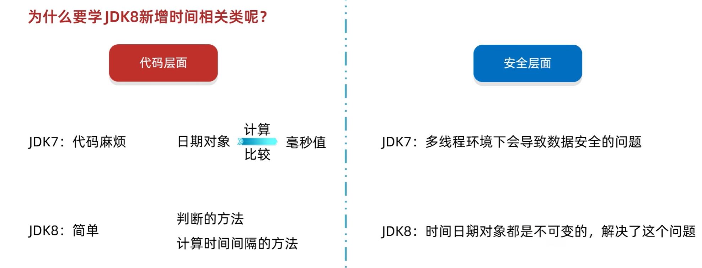


### ZoneID

ZoneID的格式如下

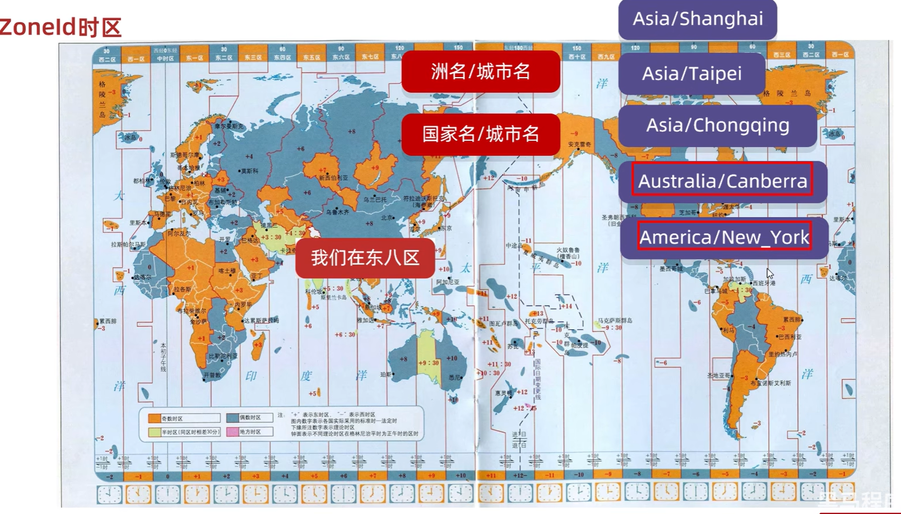

中国经常用的是`Asia/Shanghai`。当然不用记，我们可以通过如下方法获取到600个可用的时区。

| 方法名                                   | 说明                     |
| ---------------------------------------- | ------------------------ |
| static Set<String> getAvailableZoneIds() | 获取Java中支持的所有时区 |
| static ZoneId systemDefault()            | 获取系统默认时区         |
| static ZoneId of(String zoneId)          | 获取一个指定时区         |

```java
public static void main(String[] args) {
    // 获取可用时区
    Set<String> availableZoneIds = ZoneId.getAvailableZoneIds();
    System.out.println(availableZoneIds);
    System.out.println("Size = "+availableZoneIds.size());
    // 获取系统当前时区
    ZoneId zoneId = ZoneId.systemDefault();
    System.out.println(zoneId);
    // 获取指定时区，例如新加坡
    ZoneId zoneSingapore = ZoneId.of("Asia/Singapore");
    System.out.println(zoneSingapore);
}
```

```java
[Asia/Aden, America/Cuiaba, Etc/GMT+9, Etc/GMT+8, Africa/Nairobi, America/Marigot, Asia/Aqtau, Pacific/Kwajalein, ...]
Size = 603
Asia/Shanghai
Asia/Singapore
```

### Instant 时间戳


| 方法名                                    | 说明                                                 |
| ----------------------------------------- | ---------------------------------------------------- |
| `static Instant now()`                    | 获取当前时间的Instant对象（标准时间）。因此中国要+8. |
| `static Instant ofXxx(long epochMilli)`   | 根据（秒/毫秒/纳秒）获取Instant对象                  |
| `ZonedDateTime atZone(ZoneId zone)`       | 指定时区                                             |
| `boolean isXxx(Instant otherInstant)`     | 判断系列的方法                                       |
| `Instant minusXxx(long millisToSubtract)` | 减少时间系列的方法                                   |
| Instant plusXxx(long millisToSubtract)    | 增加时间系列的方法                                   |


```java
// 获取世界标准时间
Instant now = Instant.now();
System.out.println(now); // 2025-01-16T17:10:43.403487800Z 这里的z是纳秒
```

```java
// 获取世界标准时间，并指定时间戳
Instant originalTime1 = Instant.ofEpochMilli(1L);
System.out.println(originalTime1); // 1970-01-01T00:00:00.001Z
// 获取世界标准时间，并指定秒和纳秒
Instant originalTime2 = Instant.ofEpochSecond(1L);
System.out.println(originalTime2);
// 获取世界标准时间，并指定秒和纳秒
Instant originalTime3 = Instant.ofEpochSecond(1L, 1000000000L); // 1
System.out.println(originalTime3); // 就是过了2s，因此是1970-01-01T00:00:02Z
```

### ZoneDateTime带时区的时间

| 方法名                            | 说明                            |
| --------------------------------- | ------------------------------- |
| `static ZonedDateTime now()`      | 获取当前时间的ZonedDateTime对象 |
| `static ZonedDateTime ofXxx(...)` | 获取指定时间的ZonedDateTime对象 |
| `ZonedDateTime withXxx(时间)`     | 修改时间系列的方法              |
| `ZonedDateTime minusXxx(时间)`    | 减少时间系列的方法              |
| `ZonedDateTime plusXxx(时间)`     | 增加时间系列的方法              |

DateTimeFormatter

| 方法名                                     | 说明               |
| ------------------------------------------ | ------------------ |
| `static DateTimeFormatter ofPattern(格式)` | 获取格式对象       |
| `String format(时间对象)`                  | 按照指定方式格式化 |

```java
public static void main(String[] args) {
    // 任务：获取当前时间，然后输出....年....月....日 时分秒 星期几，上下午
    ZonedDateTime zonedDateTime = Instant.now().atZone(ZoneId.of("Asia/Shanghai"));
    DateTimeFormatter fmt = DateTimeFormatter.ofPattern("yyyy年MM月dd日 HH时mm分ss秒 EE a");
    System.out.println(zonedDateTime.format(fmt)); // 2025年01月17日 01时27分56秒 周五 上午
}
```

### LocalDate, LocalTime, LocalDateTime

LocalDate只包含年月日，LocalTime只包含时分秒。但是LocalDateTime包含年月日和时分秒。

```java
// LocalDate
LocalDate ld = LocalDate.now();
System.out.println(ld); // 2025-01-17
LocalDate ld1 = LocalDate.of(2024, 2,29);
System.out.println(ld1.getMonth()+"月");
// LocalTime
LocalTime lt = LocalTime.now();
System.out.println(lt); // 11:49:58.406514400
LocalTime lt1 = LocalTime.of(12, 12, 12);
System.out.println(lt1.getHour()); // 12'
// LocalDateTime
LocalDateTime ldt = LocalDateTime.now();
System.out.println(ldt); // 2025-01-17T11:51:20.956250200 这里的T指的是时间
System.out.println(ldt.atZone(ZoneId.of("Asia/Shanghai")));
```

### Duration, Period (不推荐)，ChronoUnit（推荐）

更全面，直接包括`Duration`和`Period`

```java
public static void main(String[] args) {
    // Period
    LocalDate d1 = LocalDate.of(2005,4,23);
    LocalDate d2 = LocalDate.now();
    Period p = Period.between(d1,d2);
    System.out.println("离你的出生日期已经过了"+p.getYears()+"年"+p.getMonths()+"月"+p.getDays()+"天");
    // Duration
    LocalDateTime d3 = LocalDateTime.of(2005,4,23,0,0,0);
    LocalDateTime d4 = LocalDateTime.now();
  
    Duration d = Duration.between(d3,d4);
    System.out.println("离你的出生日期已经过了"+d.toHours()+"小时");
    System.out.println("即已经过了"+d.toMinutes()+"分钟");
    System.out.println("即已经过了"+d.toMillis()+"毫秒");
    System.out.println("即已经过了"+d.toNanos()+"纳秒");
    // ChronoUnit相比上面更全面，而且不用创建对象
    System.out.println("相隔的纪元="+ChronoUnit.DAYS.between(d3,d4));
    System.out.println("相隔的年份="+ChronoUnit.YEARS.between(d3,d4));
    System.out.println("相隔的月数="+ChronoUnit.MONTHS.between(d3,d4));
    System.out.println("相隔的周数="+ChronoUnit.WEEKS.between(d3,d4));
    System.out.println("相隔的天数="+ChronoUnit.DAYS.between(d3,d4));
    System.out.println("相隔的小时数="+ChronoUnit.HOURS.between(d3,d4));
    System.out.println("相隔的分钟数="+ChronoUnit.MINUTES.between(d3,d4));
    System.out.println("相隔的秒数="+ChronoUnit.SECONDS.between(d3,d4));
    System.out.println("相隔的毫秒数="+ChronoUnit.MILLIS.between(d3,d4));
    System.out.println("相隔的微秒数="+ChronoUnit.MICROS.between(d3,d4));
    System.out.println("相隔的纳秒数="+ChronoUnit.NANOS.between(d3,d4));
    System.out.println("相隔的半天数="+ChronoUnit.HALF_DAYS.between(d3,d4));
    System.out.println("相隔的世纪数="+ChronoUnit.CENTURIES.between(d3,d4));
    System.out.println("相隔的千年数="+ChronoUnit.MILLENNIA.between(d3,d4));
    System.out.println("相隔的年代数="+ChronoUnit.ERAS.between(d3,d4));
}
```


## [9] 包装类

指的是基本数据类型对应的引用数据类型。


获取包装类对象（只做了解）。

```java
// 利用构造方法获取Integer对象
Integer a = new Integer(1);
// 利用静态方法获取Integer对象
Integer.valueOf(123);
Integer.valueOf("123");
Integer.valueOf(123,8);// 8进制下的123

// 这两种方法的区别？（需要掌握）

Integer i6 = Integer.valueOf(127);
Integer i7 = Integer.valueOf(127);
System.out.println(i6 == i7);			// TRUE

Integer i8 = Integer.valueOf(128);
Integer i9 = Integer.valueOf(128);
System.out.println(i8 == i9);			// FALSE

Integer i10 = new Integer(127);
Integer i11 = new Integer(127);
System.out.println(i10 == i11);			// FALSE

Integer i12 = new Integer(128);
Integer i13 = new Integer(128);
System.out.println(i12 == i13);			// FALSE
```

在Java中`-128`~`127`范围的`Integer`对象会首先储存到一个叫做`cache`的数组中。如果你用`valueOf()`方法的话会先检查范围然后决定是否返回`cache`数组的内容还是新的。

```java
static final Integer[] cache;
```

以前的手动装箱和手动拆箱：

```java
Integer i1 = Integer.valueOf(100);
Integer i2 = Integer.valueOf(200);
int result = i1 + i2;
Integer i3 = Integer.valueOf(result);
```

JDK5之后引入了自动拆箱和装箱：

```java
Integer i1 = 100;
Integer i2 = 300;
Integer i3 = i1+i2;
```

现在直接把`Integer`看成`int`就行。

比如

```java
int a = Integer.parseInt(str);
list.add(a);
```

这里的`list.add(a);`实际上等于`list.add(Integer.valueOf(a));`。在提示中会有 Remove Boxing 字样。

| 方法名                                       | 说明                                  |
| -------------------------------------------- | ------------------------------------- |
| `public static String toBinaryString(int i)` | 得到二进制                            |
| `public static String toOctalString(int i)`  | 得到八进制                            |
| `public static String toHexString(int i)`    | 得到十六进制                          |
| `public static int parseInt(String s)`       | 将字符串类型的整数转成 int 类型的整数 |

这里为什么返回类型是`String`? 因为`int`等类型长度不够。

```java
// 把1223012这个十进制转为二进制
System.out.println(Integer.toBinaryString(1223012)); // 100101010100101100100
```

Java是强类型语言。也就是每种数据在Java中都有各自的数据类型。如果数据类型不一致那么就无法直接计算。

```java
// 假设有字符串12，是十六进制的，我们现在把他转为10进制
System.out.println(Integer.parseInt("12", 16));
```

## [10] Arrays

| 方法名                                                      | 说明                     |
| ----------------------------------------------------------- | ------------------------ |
| public static String toString(数组)                         | 把数组拼接成一个字符串   |
| public static int binarySearch(数组, 查找的元素)            | 二分查找法查找元素       |
| public static int[] copyOf(原数组, 新数组长度)              | 拷贝数组                 |
| public static int[] copyOfRange(原数组, 起始索引, 结束索引) | 拷贝数组（指定范围）     |
| public static void fill(数组, 元素)                         | 填充数组                 |
| public static void sort(数组)                               | 按照默认方式进行数组排序 |
| public static void sort(数组, 排序规则)                     | 按照指定的规则排序       |


```java
//binarySearch: 二分查找法查找元素
//细节1: 二分查找的前提: 数组中的元素必须是有序，数组中的元素必须是升序的
//细节2: 如果要查找的元素是存在的, 那么返回的是真实的索引
//但是, 如果要查找的元素是不存在的, 返回的是 -插入点 - 1
//疑问: 为什么要减1呢?
//解释: 如果此时, 我现在要查找数字0, 那么如果返回的值是-插入点, 就会出现问题了。
//如果要查找数字0, 此时0是不存在的, 但是按照上面的规则-插入点, 应该就是-0
//为了避免这样的情况, Java在这个基础上又减一。
int[] arr = {1, 2, 3, 4, 5, 6, 7, 8, 9, 10};
System.out.println(Arrays.binarySearch(arr, 5)); // 4
System.out.println(Arrays.binarySearch(arr, 0)); // -1
```

```
// copyOf: 拷贝数组
// 参数一：老数组
// 参数二：新数组的长度
// 方法的底层会根据第二个参数来创建新的数组
// 如果新数组的长度是小于老数组的长度，会部分拷贝
// 如果新数组的长度是等于老数组的长度，会完全拷贝
// 如果新数组的长度是大于老数组的长度，会补上默认初始值
System.out.println("-------------------copyOf-------------------");
int[] newArr1 = Arrays.copyOf(arr, 20);
System.out.println(Arrays.toString(newArr1)); // [1, 2, 3, 4, 5, 6, 7, 8, 9, 10]
```

```java
/**
 * public static void sort(数组, 排序规则)    按照指定的规则排序
 *
 * 参数一：要排序的数组
 * 参数二：排序的规则
 *
 * 细节：
 * 只能给引用数据类型的数组进行排序
 * 如果数组是基本数据类型的，需要变成其对于的包装类
 */
Integer[] arr = {2, 3, 1, 5, 6, 7, 8, 4, 9};

// 第二个参数是一个接口，所以我们在调用方法的时候，需要传递这个接口的实现类对象，作为排序的规则。
// 但是这个实现类，我只要使用一次，所以就没有必要单独的去写一个类，直接采取匿名内部类的方式就可以。

// 底层原理:
// 利用插入排序 + 二分查找的方式进行排序的。
// 默认把0索引的数据当做是有序的序列，1索引到最后认为是无序的序列。
// 遍历无序的序列得到里面的每一个元素，假设当前遍历得到的元素是A元素
// 把A往有序序列中进行插入，在插入的时候，是利用二分查找确定A元素的插入点。
// 拿着A元素，跟插入点的元素进行比较，比较的规则就是compare方法的方法体
// 如果方法的返回值是负数，拿着A继续跟前面的数据进行比较
// 如果方法的返回值是正数，拿着A继续跟后面的数据进行比较
// 如果方法的返回值是0，也拿着A跟后面的数据进行比较
// 直到能确定A的最终位置为止。

// compare方法的形式参数:
// 参数一 o1: 表示在无序序列中，遍历得到的每一个元素
// 参数二 o2: 有序序列中的元素

// 返回值:
// 负数: 表示当前要插入的元素是小的，放在前面
// 正数: 表示当前要插入的元素是大的，放在后面
// 0: 表示当前要插入的元素跟现在的元素比是一样的们也会放在后面

// 简单理解:
// o1 - o2 : 升序排列
// o2 - o1 : 降序排列

Integer[] arr = {2, 3, 1, 5, 6, 7, 8, 4, 9};
Arrays.sort(arr, new Comparator<Integer>() {
    @Override
    public int compare(Integer o1, Integer o2) {
        System.out.println("------------------------");
        System.out.println("o1 : " + o1);
        System.out.println("o2 : " + o2);
        return o1 - o2;
    }
});

System.out.println(Arrays.toString(arr)); // [1, 2, 3, 5, 6, 7, 8, 4, 9]

```


