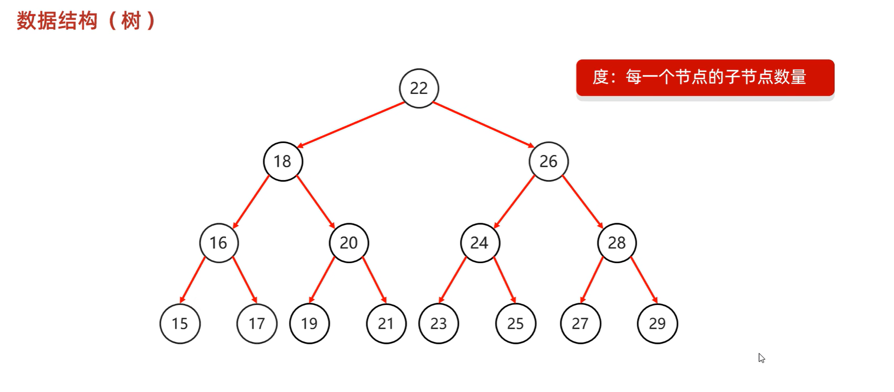
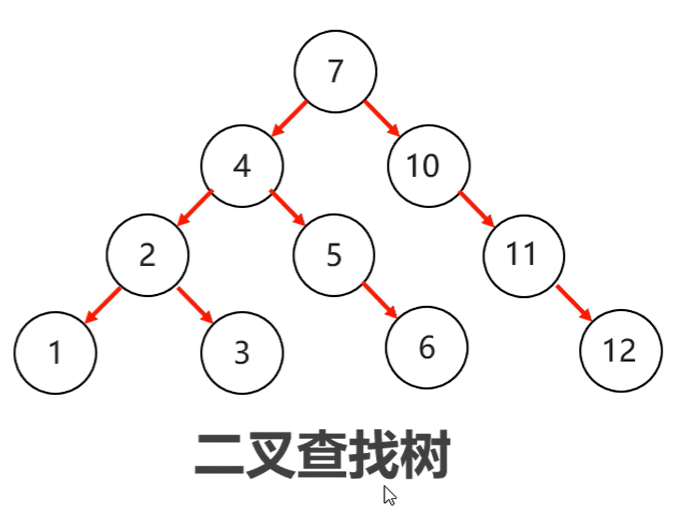
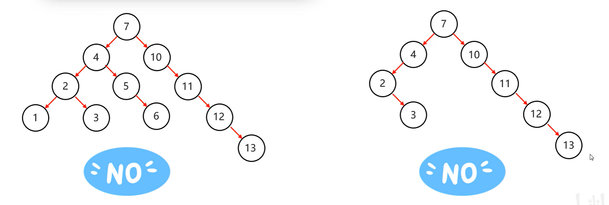
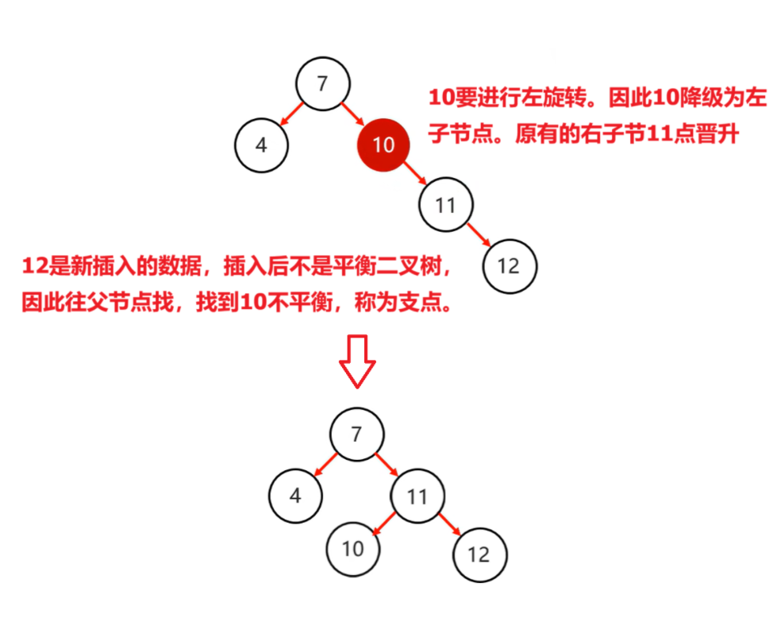
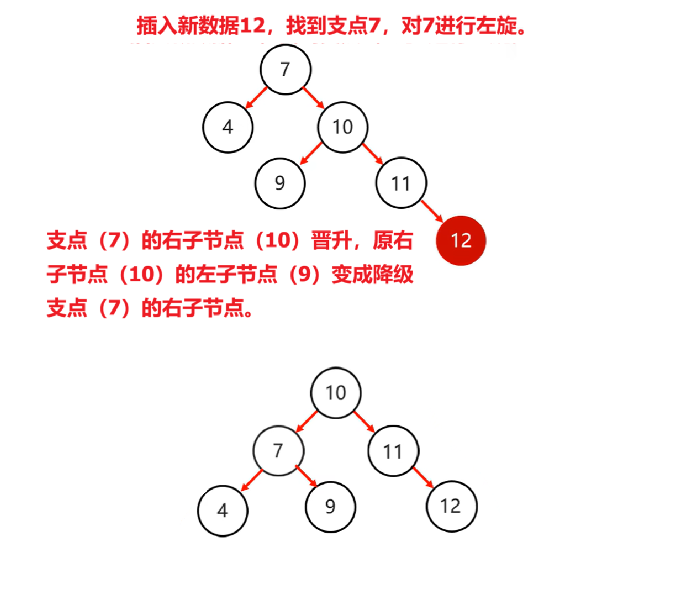
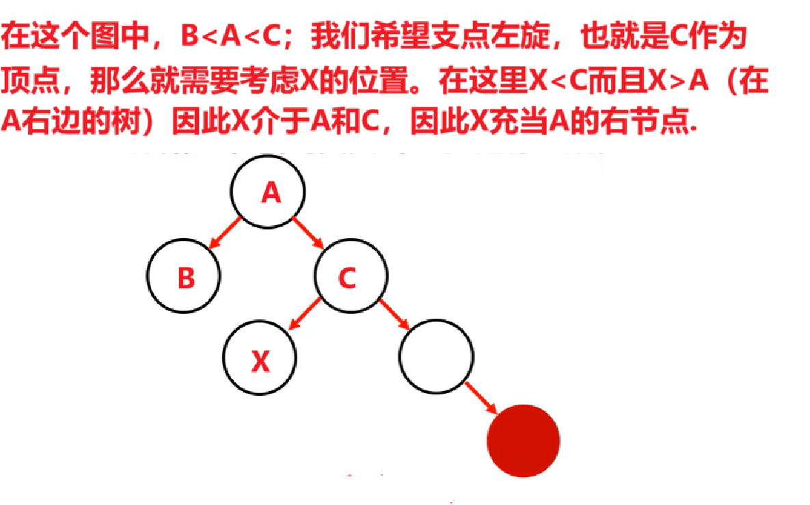
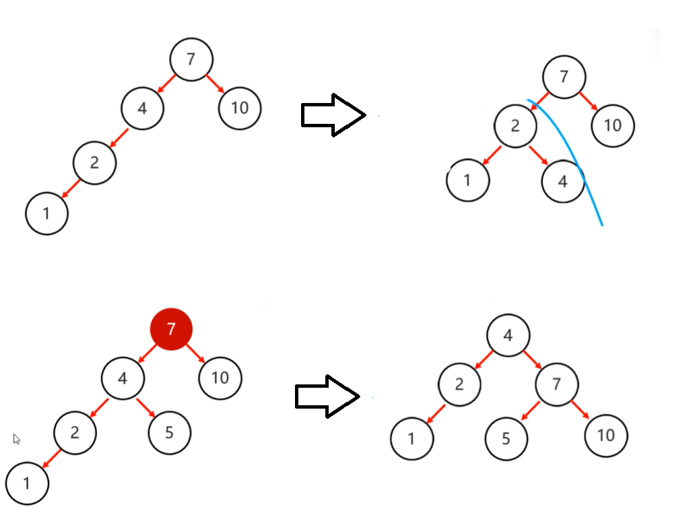
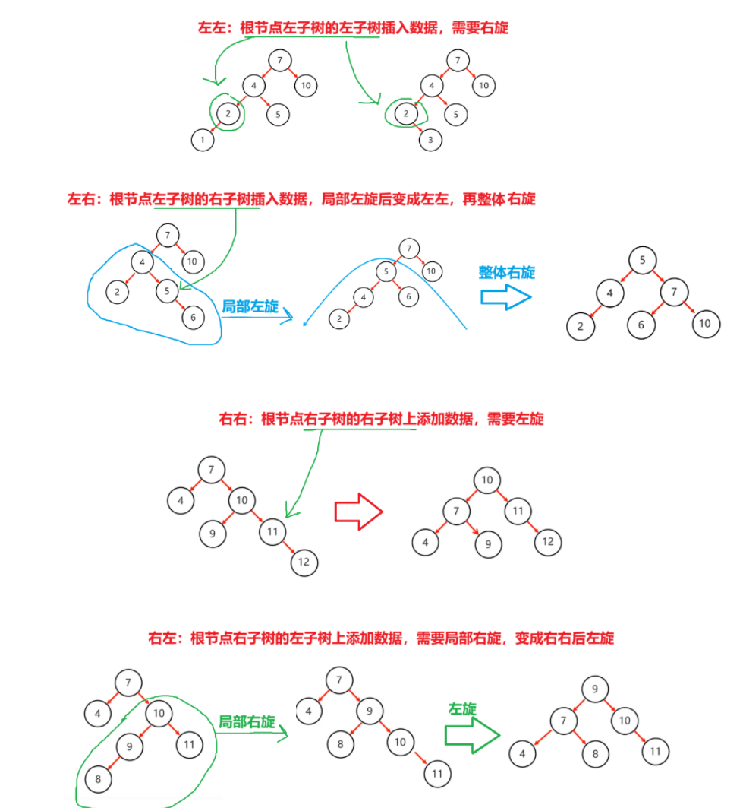
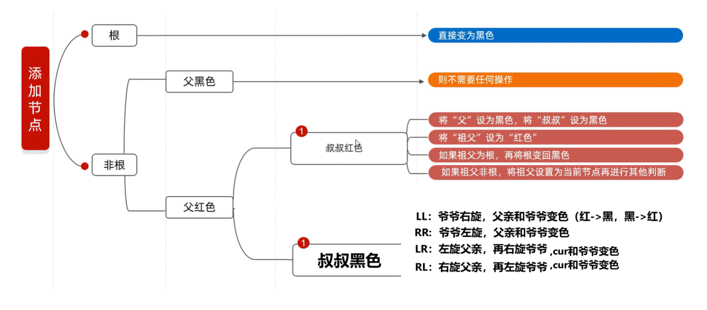
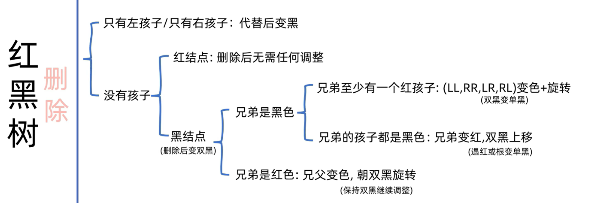

# 数据结构（树）

___

___

上图是一个二叉树，二叉树满足任意节点的度$≤2$；

根节点：最上层，22.

树高：总层数，4.

___

___

## [1] 二叉查找树

（二叉搜索树，二叉排序树）特点：

1. 每一个节点中最多有两个子节点
2. 大小值：左$>$中$>$右

## [2] 平衡二叉树

（继承二叉查找树，但是多了一条规则3）

1. 每一个节点中最多有两个子节点
2. 大小值：左$>$中$>$右
3. **任意**节点左右子树高度不超过1

例如下图都不是平衡二叉树

___

___

平衡二叉树的难点就是如何保持平衡。其核心是旋转机制。当添加一个节点之后，该树不再是一个平衡二叉树那么就会触发旋转机制。旋转分为

1. 左旋（支点右侧比左侧多，进行左旋）
2. 右旋（支点左侧比右侧多，进行右旋）

### 1. 左旋

简单情况步骤如下：

​	首先，当一个数据添加后，该树不再是一个平衡二叉树，那么我们就需要从**<u>添加的节点开始</u>**不断地往父节点找不平衡的节点。这个点称为支点。

​	对支点进行旋转操作（例如左旋，把支点降级为左子节点，原来的右子节点晋升）。

___

___

复杂情况步骤如下：

​	仍然先找到支点。支点的右子节点晋升，原右子节点的左子节点变成降级节点的右子节点。

___

___

疑问：为什么这个9可以作为降级支点的右节点？

___

___

### 2. 右旋

和左旋相反。

___

___

简单右旋：支点左节点晋升，支点充当晋升节点的右节点

复杂右旋：支点左子节点晋升，晋升节点右子节点作为支点左子节点。

### 组合情况

___

___

## [3] 红黑树

1972年出现，当时被称为平衡二叉B树，1978年被改为红黑树

1. 是二叉查找树（但不是高度平衡的，因为他不是平衡二叉树）
2. 满足特定红黑规则

红黑规则如下

1. 节点必须只能是红色和黑色之一
2. 根节点必须为黑色
3. 如果一个节点**没有子节点**或者**没有父节点**，这个点相对应的指针属性为`Nil`，其中`Nil`视为叶节点，每个叶节点`Nil`都是黑色的（叶节点为黑色）
4. 如果一个节点是红色，那么它的子节点必须都是黑色的（也就是不存在两个红色节点相连接的情况，但是黑色可以）
5. 对于任意节点，从节点到其所有后代叶子节点的简单路径上，均包含相同数目的黑色节点。

默认颜色为红色（效率高）

插入规则如下（个人更改过）：

