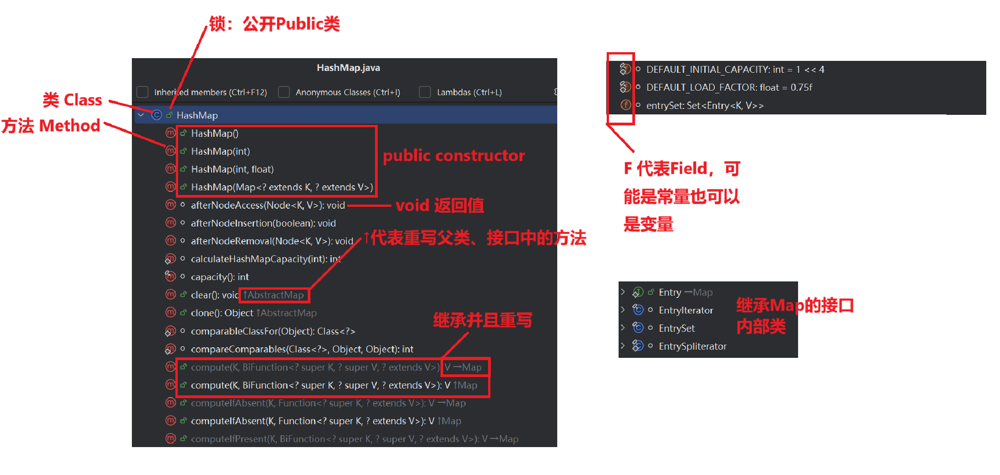

集合体系结构

`Collection`：单列集合，也就是一次只能添加一个元素。

`Map`：双列集合，添加数据的时候是一对数据。

# Collection

Collection分为`List`和`Set`。

`List`：`ArrayList`、`LinkedList`和`Vector`（已淘汰）。

> ​	List 集合特点是 **有序**、**可重复**、**有索引**。（这里的有序是指存和取的东西是一样的，和排序没任何关系）

`Set`：`HashSet`、`TreeSet`。其中`HashSet`下包含`LinkedHashSet`。

> ​	Set 集合的特点是 无序，不重复，无索引。无序指的是，存入a、b、c取出来不一定是a、b、c；

___


___

Collection是单列集合的祖宗接口，它的功能是全部单列集合都可以继承使用的。

| 方法名称                              | 说明                             |
| ------------------------------------- | -------------------------------- |
| `public boolean add(E e)`             | 把给定的对象添加到当前集合中     |
| `public void clear()`                 | 清空集合中所有的元素             |
| `public boolean remove(E e)`          | 把给定的对象在当前集合中删除     |
| `public boolean contains(Object obj)` | 判断当前集合中是否包含给定的对象 |
| `public boolean isEmpty()`            | 判断当前集合是否为空             |
| `public int size()`                   | 返回集合中元素的个数/集合的长度  |

其中`.add(E e)`对象方法中是boolean类型的返回值，对于List而言返回的都是`True`，而Set则可能是`True`可能是`False`因为要考虑到重复的情况，

值得注意的是，`Collection`中的`.contains(Object obj)`底层是通过`.equals`方法判断是否相等的。

例如：

```java
Collection<String> c = new ArrayList<>();
boolean contains = c.contains("123");
```

在 `ArrayList` 中对应的方法是：

```java
public boolean contains(Object o) {
    return indexOf(o) >= 0;
}
public int indexOf(Object o) {
    return indexOfRange(o, 0, size);
}
int indexOfRange(Object o, int start, int end) { // ArrayList中是直接拿着传入的Object o 中的.equals方法比较
    Object[] es = elementData;
    if (o == null) {
        for (int i = start; i < end; i++) {
            if (es[i] == null) {
                return i;
            }
        }
    } else {
        for (int i = start; i < end; i++) {
            if (o.equals(es[i])) {
                return i;
            }
        }
    }
    return -1;
}
```

简而言之，`ArrayList`中是直接拿着传入的Object o 中的`.equals()`方法比较。那么如果我们自定义一个类，比如Student类，那么javabean中不重写`.equals()`方法的话ArrayList就会拿着地址值比较了（也就是直接使用Object中的`equals`方法），就不能得到想要的答案。

## [1] Collection 的3种遍历方式

1. 迭代器遍历
2. 增强for遍历
3. Lambda表达式遍历

### 迭代器遍历

迭代器不依赖索引，其类叫`Iterator`。迭代器遍历时，不能用集合的方法进行增加或者删除，会发生并发修改异常`ConcurrentModificationException`。如果需要删除，那么就用迭代器提供的`.remove()`方法进行删除。如果要添加元素，现在还没有办法。

**Collection集合获取迭代器**

| 方法名称                 | 说明                                    |
| ------------------------ | --------------------------------------- |
| `Iterator<E> iterator()` | 返回迭代器对象，默认指向当前集合的0索引 |

**Iterator中的常用方法**

| 方法名称            | 说明                                                      |
| ------------------- | --------------------------------------------------------- |
| `boolean hasNext()` | 判断当前位置是否有元素，有元素返回true，没有元素返回false |
| `E next()`          | 获取当前位置的元素，并将迭代器对象移向下一个位置。        |

`.hasNext()`这个是判断当前位置是否有元素，而不是下一个是否有元素。
`.next()`这个会做2个事情，一个是获取当前元素，然后移动指针到下一位。

```java
Collection<String> coll = new ArrayList<>();
coll.add("123");
coll.add("456");
coll.add("789");
coll.add("000");
Iterator<String> it = coll.iterator();
while (it.hasNext()){
    System.out.println(it.next());
}
```

### 增强`for`遍历

- 增强`for`的底层就是迭代器，为了简化迭代器的代码书写的。
- 它是JDK5之后出现的，其内部原理就是一个`Iterator`迭代器
- 所有的单列集合和数组才能用增强for进行遍历。

格式：

```java
for (元素的数据类型 变量名 : 数组或者集合) {
}
```
示例：
```java
for (String s : list) {
    System.out.println(s);
}
// list.for 按下tab自动补全
```

细节：修改增强`for`的第三方变量不会改变原本集合中的数据。

### Lambda表达式遍历
得益于JDK 8开始的新技术Lambda表达式，提供了一种更简单、更直接的遍历集合的方式。

| 方法名称                                           | 说明               |
| -------------------------------------------------- | ------------------ |
| `default void forEach(Consumer<? super T> action)` | 结合lambda遍历集合 |

这里的Consumer是接口，我们可以利用匿名内部类的形式。

```java
coll.forEach(new Consumer<String>() // 接口
    // 匿名内部类
    {
    @Override
    public void accept(String s) { // 这里的s就是依次表示集合中的每个数据。
        // 这里直接操作s即可
        
    }
});
```

`forEach`的底层原理，其实也会自己遍历集合然后得到每一个元素，然后交给accept方法。

简化后的匿名内部类，也就是Lambda表达式可以这样写：

```java
coll.forEach(s -> System.out.println(s));
```


## [2] List

- 有序：存和取的元素顺序一致

- 有索引：可以通过索引操作元素

- 可重复：存储的元素可以重复 

  

- Collection的方法List都继承了
- List集合因为有索引，所以多了很多索引操作的方法。

| 方法名称                         | 说明                                   |
| -------------------------------- | -------------------------------------- |
| `void add(int index, E element)` | 在此集合中的指定位置插入指定的元素     |
| `E remove(int index)`            | 删除指定索引处的元素，返回被删除的元素 |
| `E set(int index, E element)`    | 修改指定索引处的元素，返回被修改的元素 |
| `E get(int index)`               | 返回指定索引处的元素                   |

List 也是一个接口，我们不能直接创建接口的对象。因此我们需要用多态的方式创建其实现类对象。

```java
List<String> list = new ArrayList<>();
```

假设我们现在有一个list，那么我们添加元素：

```tex
		|  ↓ list.add(1,"X");
		|a b c
  result|a X b c
```

假设我们现在的List中:

```java
list.add(1);
list.add(2);
list.add(3);
//请问：此时删除的是1这个元素，还是1索引上的元素？
//为什么？
//因为在调用方法的时候，如果方法出现了重载现象
//优先调用，实参跟形参类型一致的那个方法。
list.remove(1); //这个时候集合变成[1,3]
```

```java
list.add(1);
list.add(2);
list.add(3);
//手动装箱，手动把基本数据类型的1，变成Integer类型
Integer i = Integer.valueOf(1);
list.remove(i); // 这个时候集合变成 [2,3]
```

> 在调用方法的时候，如果方法出现了重载现象，那么优先调用实参跟形参类型一致的那个方法。

### List集合的遍历方式：列表迭代器 `ListIterator`

List 继承于Collection，当然能用Collection的3种遍历方式。当然也有自己独有的遍历方式。列表迭代器继承于迭代器，接口继承接口，子接口。

| 方法                    | 说明                                                         |
| ----------------------- | ------------------------------------------------------------ |
| `void add(E e)`         | 将指定的元素插入列表（可选操作）。                           |
| `boolean hasNext()`     | 以正向遍历列表时，如果列表迭代器有多个元素，则返回 true（换句话说，如果 next 返回一个元素而不是抛出异常，则返回 true）。 |
| `boolean hasPrevious()` | 如果以逆向遍历列表，列表迭代器有多个元素，则返回 true。      |
| `E next()`              | 返回列表中的下一个元素。                                     |
| `int nextIndex()`       | 返回对 next 的后续调用所返回元素的索引。                     |
| `E previous()`          | 返回列表中的前一个元素。                                     |
| `int previousIndex()`   | 返回对 previous 的后续调用所返回元素的索引。                 |
| `void remove()`         | 从列表中移除由 next 或 previous 返回的最后一个元素（可选操作）。 |
| `void set(E e)`         | 用指定元素替换 next 或 previous 返回的最后一个元素（可选操作）。 |

这里的 `hasPrevious()`、`previous`与`hasNext()`、`next()`恰好是相反的。

> 注意并发修改异常！当使用迭代器的使用，增删查改应使用迭代器提供的方法，不要使用list的方法。


数据结构：计算机储存组织数据的方式。是指数据之间是以什么样的方式排列在一起的。

1. 每种数据结构长什么样？
2. 如何添加数据?
3. 如何删除数据？

栈：后进先出，先进后出；

队列：先进先出，后进后出；

数组：查询快，增删慢；链表中的节点是独立对象，在内存中不是连续的。

### ArrayList

底层原理：

ArrayList底层是数组结构的。利用空参构造创建的ArrayList集合是一个长度为0的数组。而且数组的名字叫做`elementDate`以及成员变量`size=0`; 当添加第一个数据之后，ArrayList才会开始创建一个长度为10的数组。默认初始化值为`null`；

对于`size`有两层含义：指元素个数、指下次存入位置。 例如我们存入`a`之后，下标0是`a`。此时的`size`是指向下标1处。

存满后，自动扩容1.5倍。

如果是利用`.addAll()`方法一次添加多个数据，而且其1.5倍还放不下，那么新创建的数组以实际长度为准。


看源码：（Ctrl+N 输入 `ArrayList`， 然后 Alt + 7 切换为大纲视图或者 Ctrl + F12 进行查找）

___


___


### LinkedList

底层数据结构是双链表，查询慢，首尾操作的速度是极快的，所以多了很多首尾操作的特有API。

| 特有方法                    | 说明                             |
| --------------------------- | -------------------------------- |
| `public void addFirst(E e)` | 在该列表开头插入指定的元素       |
| `public void addLast(E e)`  | 将指定的元素追加到此列表的末尾   |
| `public E getFirst()`       | 返回此列表中的第一个元素         |
| `public E getLast()`        | 返回此列表中的最后一个元素       |
| `public E removeFirst()`    | 从此列表中删除并返回第一个元素   |
| `public E removeLast()`     | 从此列表中删除并返回最后一个元素 |

___


___

## [3] 迭代器底层

___


___

## [4] 泛型深入

**泛型**(Generics)：是JDK**5**中引入的特性，可以在编译阶段约束操作的数据类型，并进行检查。

**泛型的格式**：`<数据类型>`

**注意**：泛型只能支持引用数据类型，不允许基本数据类型（因为基本数据类型无法转为Object）。 如果是整数，请使用对应包装类`Integer`。

Java中的泛型是伪泛型，虽然在编译阶段能够限定统一类型例如`String`，但是实际上还是当成`Object`处理。然后再拿出来的时候，会再把`Object`进行强转。

Java文件中存在泛型，但是编译成`class`字节码文件后泛型就会消失，也就称为**泛型的擦除**。

泛型除了传入指定的数据类型，还能传递该类的子类（但是一般不这样干）；如果不写泛型，默认为Object；

### 泛型定义处

泛型可以在很多地方被定义。

1. 类后面（泛型类）
2. 方法上面（泛型方法）
3. 接口后面（泛型接口）

泛型类：

在一个类中，某个变量的数据类型不确定时，就可以定义带有泛型的类。

```java
public class ArrayList<E>{
    
}
```

> 此处的`E`可以理解为变量。但是不是用来记录数据的，而是记录数据的**类型**。可以写成 T、E、K、V等（随便）。
>

```java
// 泛型类
public class MyArrayList<E> {
    Object[] obj = new Object[10];
    int size;

    /*
    E : 表示是不确定的类型。该类型在类名后面已经定义过了。
    e：形参的名字，变量名
    */
    public boolean add(E e){
        obj[size] = e;
        size++;
        return true;
    }

    public E get(int index){
        return (E)obj[index];
    }

    @Override
    public String toString() {
        return Arrays.toString(obj);
    }
}
```

除了直接给类定义泛型`E`，我们还可以给方法定义局部的泛型`E`。这称为泛型方法。

除了上述的，还有泛型接口。在泛型接口的实现类中可以直接定义泛型具体类型。例如我们要实现泛型接口`List<E>`。

```java
public class MyArrayList2 implements List<String>{
    // ...
}
```

当然，我们可以写一个泛型实现类

```java
public class MyArrayList2<E> implements List<E>{
    // ...
}
```


泛型不具备继承性。

```java
public static void method(ArrayList<A> list)
{
    
}
```

即便继承结构`A <- B <- C`，也不能传入`method(ArrayList<B> list)`等子类数据类型。


如果我们现在有继承的3个类`A（父类） <- B <- C（子类）`，并且希望泛型E只接收这三个类，那么就可以考虑泛型的通配符。

例如，

```java
public static void method(ArrayList<? extends A> list)
{
    // 能传入 A, B, C； 这个？代表所有extends A的类包括A本身
}
```

```java
public static void method(ArrayList<? spuer C> list)
{
    // 能传入 A, B, C； 这个？代表所有 spuer C的类包括C本身（即能传入所有父类）
}
```

泛型不仅仅能定义一个，还能定义多个

```java
public class Animals<N,I>{
    private N name;
    private I age;
    // ... 
}
```


## [5] Set 集合实现类

| 实现类          | 有序性 | 重复性 | 是否有索引 |
| --------------- | ------ | ------ | ---------- |
| `HashSet`       | 无序   | 不重复 | 无索引     |
| `LinkedHashSet` | 有序   | 不重复 | 无索引     |
| `TreeSet`       | 可排序 | 不重复 | 无索引     |

```java
Set<String> s = new HashSet<>(); // Set 是接口，用多态的方法创建Set接口实现类HashSet的对象
```

## [6] [单列集合] HashSet

### HashSet底层原理

- HashSet集合底层采取**哈希表**存储数据
- 哈希表是一种对于增删改查数据性能都较好的结构

### 哈希表组成
| JDK版本  | 组成结构             |
| -------- | -------------------- |
| JDK8之前 | 数组+链表            |
| JDK8开始 | 数组+链表+**红黑树** |

```java
int index = (数组长度-1) & 哈希值
```

### 哈希值

- 根据hashCode方法算出来的int类型的整数
- 该方法定义在Object类中，所有对象都可以调用，默认使用地址值进行计算
- 一般情况下，会重写`hashCode`方法，利用对象内部的属性值计算哈希值

### 对象的哈希值特点
- 如果没有重写`hashCode`方法，不同对象计算出的哈希值是不同的
- 如果已经重写`hashcode`方法，不同的对象只要属性值相同，计算出的哈希值就是一样的
- 在小部分情况下，不同的属性值或者不同的地址值计算出来的哈希值也有可能一样。（哈希碰撞）

### HashSet插入步骤：

1. 创建一个默认长度16，默认加载因子为0.75的数组，数组名`table`

   > 如果数组是16个长度，当前长度为 $16\times 0.75 = 12$，数组就会扩容成原先的两倍
   >
   > 如果链表长度 > 8 而且数组长度 >= 64 ：链表转红黑树

2. 根据元素的哈希值跟数组的长度计算出应存入的位置

3. 判断当前位置是否为`null`，如果是`null`直接存入

4. 如果位置不为`null`，表示有元素，则调用`equals`方法比较属性值

5. 
   - 一样：不存
   - 不一样：存入数组，形成链表
     - JDK8以前：新元素存入数组，老元素挂在新元素下面
     - JDK8以后：新元素直接挂在老元素下面

**如果集合中存储的是自定义对象，那么必须重写`hashCode`和`equals`方法！否则就用`Object.equals`的方法（地址值）就会导致重复!**

### LinkedHashSet

他爹：HashSet

`LinkedHashSet`  **有序**  不重复  无索引


`TreeSet`  **可排序**  不重复  无索引

### TreeSet 集合默认的规则

- 对于数值类型：Integer，Double，默认按照从小到大的顺序进行排序。
- 对于字符、字符串类型：按照字符在 ASCII 码表中的数字升序进行排序。

> 字符串比较规则：
>
> 1. 逐位比较字符串，一旦发现大的，直接返回。
> 2. 如果像 ab -- abc 这种，比较ab相同，但是ab少了一位，少的位默认为最小，比较下来abc更大

如果是写了自己的类，就需要重写比较规则

第一种方法，默认排序/自然排序

让 `Student` 类 实现 `Comparable` 接口。

```java
public class student implements Comparable<student>{
    @Override
    public int compareTo(student o) {
        return this.age - o.age;
    }
}
```

第二种方法：创建比较器对象（匿名内部类）

```java
TreeSet<String> ts = new TreeSet<>(new Comparator<String>() {
            @Override
            public int compare(String o1, String o2) {
                if(o1.length() > o2.length()) return 1;
                return o2.compareTo(o1);
            }
        });
```

如果两种方法同时存在，以方式二为准（例如String下定义了比较方法，但是仍然可以用比较器来比较）。

## [7] [双列集合] Map


### 双列集合的特点

1. 一次存储两个相关联的数据，即键（Key）和值（Value） ，二者构成数据存储的基本单元。
2. 键具有唯一性，不能重复，而值可以重复出现。这保证了通过键能唯一地定位到对应的值。
3. 键值之间存在一对一的映射关系，每个键只能与一个值关联，通过键能准确找到对应的值。
4. 键和值组合在一起称为 “键值对” 或 “键值对对象”，在 Java 中以 “Entry 对象” 表示，是双列集合中数据操作和遍历的重要概念。

#### 方法

| 方法名称                              | 说明                                 |
| ------------------------------------- | ------------------------------------ |
| `V put(K key, V value)`               | 添加元素                             |
| `V remove(Object key)`                | 根据键删除键值对元素                 |
| `void clear()`                        | 移除所有的键值对元素                 |
| `boolean containsKey(Object key)`     | 判断集合是否包含指定的键             |
| `boolean containsValue(Object value)` | 判断集合是否包含指定的值             |
| `boolean isEmpty()`                   | 判断集合是否为空                     |
| `int size()`                          | 集合的长度，也就是集合中键值对的个数 |

```java
Map<String, String> m = new HashMap<>();
m.put("key1","value1");
m.put("key2","value2");
m.put("key3","value3");
m.put("key1","valueInsert"); // 如果这个 Key 已经存在，就会弹出原来的 Value
							 // 弹出 value1
```

`put`: 如果键不存在，直接添加。添加数据的时候，那么添加数据的时候，Java会把原有的键值对覆盖，并且返回被覆盖的**值**。（否则返回null）

`remove`：如果删除，就返回值。

### 遍历方式 

1. 通过`.keySet()`方法获取 Key的集合来遍历

   ```java
   public static void main(String[] args) {
           Map<String, String > m = new HashMap<>();
           Set<String> keySet = m.keySet(); // Key Set
           // 增强for遍历
           for (String s : keySet) {
               // ...
           }
           // lambda表达式遍历
           keySet.forEach(new Consumer<String>() {
               @Override
               public void accept(String s) {
                   // ...
               }
           });
           // 迭代器遍历
           Iterator<String> iterator = keySet.iterator();
           while (iterator.hasNext()) {
               String s = iterator.next();
               // ...
           }
       }
   ```

2. 通过`entrySet()`

   ```java
   public static void main(String[] args) {
           Map<String, String > m = new HashMap<>();
           Set<Map.Entry<String, String>> entries = m.entrySet();
           // 增强for
           for (Map.Entry<String, String> entry : entries) {
               String key = entry.getKey();
               String value = entry.getValue();
               // ...
           }
           // lambda表达式(使用map)
           m.forEach(new BiConsumer<String, String>() {
               @Override
               public void accept(String s, String s2) {
                   // ...
               }
           });
           Iterator<Map.Entry<String, String>> iterator = entries.iterator();
           while (iterator.hasNext()) {
               String key = iterator.next().getKey();
               String value = iterator.next().getValue();
               // ...
           }
       }
   ```


### HashMap

哈希Map不需要学习额外的东西。其数底层和HashSet是一模一样的。 

### LinkedHashMap

相比HashMap，其存取有序。增加了双向链表。参考`LinkedHashSet`。

### TreeMap

TreeMap
- TreeMap跟TreeSet底层原理一样，都是红黑树结构的。
- 由键决定特性：不重复、无索引、可排序
- 可排序：对键进行排序。
- **注意：默认按照键的从小到大进行排序，也可以自己规定键的排序规则**

代码书写两种排序规则
- 实现Comparable接口，指定比较规则。
- 创建集合时传递Comparator比较器对象，指定比较规则。 

```java
public static void main(String[] args) {
        TreeMap<Integer, String> map = new TreeMap<>(new Comparator<Integer>() {
            @Override
            public int compare(Integer o1, Integer o2) {
                return o2-o1;
            }
        });
        map.put(2, "Banana");
        map.put(1, "Apple");
        map.put(4, "Pear");
        map.put(5, "Grape");
        map.put(3, "Orange");
        System.out.println(map);

    }
```

## [8] 查看HashMap源码

___

___

___

___


___

最关键的方法：插入节点

```java
// 第一个变量 hash 代表当前传入键的哈希值
// 第二个变量 key 代表键
// 第三个变量 value 代表值
// 第四个变量： 当键重复是否保留，默认调用这个方法传入的是false，也就是键重复不保留（会替换）

final V putVal(int hash, K key, V value, boolean onlyIfAbsent,boolean evict) {
    // 定义一个局部变量tab，用来记录哈希表中的数组地址值
    // 虽然 HashMap类中已经有成员变量 Node<K,V> table 了，但是成员变量是存在堆中的
    // 接下来要反复调用这个table的话，不如在这里定义一个局部的，保存在栈里的，更快。
    Node<K,V>[] tab; 
    // 临时的第三方变量，记录键值对对象的地址值
    Node<K,V> p; 
    // n表示当前数组的长度
    // i表示索引
    int n, i;
    
    
    // (tab = table) == null  相当于 tab = table; table==null
    if ((tab = table) == null 
        || (n = tab.length) == 0)
        // tab =- resize(); resize会做以下事情：
        // 1. 如果当前是第一次添加数据，就会创建一个长度为16，默认加载因子为0.75的数组
        // 2. 如果不是第一次添加数据，会看数组中的元素个数是否达到了扩容条件。
        //    如果达到条件，就扩容1倍
        // 3. 所有的链表和红黑树会转移到新的数组中
        
        // n = tab.length; 
        n = (tab = resize()).length;
    
    
    // (p = tab[i = (n - 1) & hash]) == null
    // i = (n - 1) & hash 拿着数组的长度和哈希值进行计算，计算出当前键值对对象应存入的位置
    // p = tab[i]
    // 判断 p 是否为 null
    if ((p = tab[i = (n - 1) & hash]) == null)
        // 如果是null，newNode做的事情：在底层就是创建了一个Node<K,V>对象
        // 然后直接放到null的地方，现在就不是null了
        tab[i] = newNode(hash, key, value, null);
    
    else {
        // 现在遇到了哈希冲突，也就是这个待插入的位置不为null了。
        Node<K,V> e; K k;
        if (p.hash == hash // p.hash 代表待插入位置的哈希
            			   // hash代表当前待插入节点的哈希
            			((k = p.key) == key || (key != null && key.equals(k))))
            e = p;
        // 他们的哈希不同。判断是不是树节点
        else if (p instanceof TreeNode)
            // 哈希不同，而且是树节点。
            e = ((TreeNode<K,V>)p).putTreeVal(this, tab, hash, key, value);
        // 哈希不同，是链表节点
        else {
            // 没写条件默认true
            for (int binCount = 0; ; ++binCount) {
                // p.next 代表下一个节点然后赋值给e
                if ((e = p.next) == null) {
                    // 获取到 e = p.next, e == null
                    // 那么 p.next就申请一个新的节点，即为待插入节点
                    p.next = newNode(hash, key, value, null);
                    // 如果链表长度超过8那么转为红黑树
                    // 这里-1是因为binCount从0开始计算，实际上可以写成binCount+1>=...
                    if (binCount >= TREEIFY_THRESHOLD - 1)
                        // treeifyBin的底层还会判断数组长度是否>=64
                        // 如果符合： 链表>8 && 数组长度 >= 64 那么转为红黑树
                        treeifyBin(tab, hash);
                    break;
                }
                // e 其实相当于指针，一直往下指
                // 计算e和待插入点的哈希是否相同
                // 如果哈希值一样，就会调用equals方法
                // 如果equals方法不一样但是hash一样，就是发生了哈希碰撞
                // 比如abc 和acD
                // 如果哈希值一样，内部属性不一样，也就是哈希碰撞，那么还是继续往下指...
                // 直到K完全完全 两者哈希相同，而且内部属性值相同才break
                if (e.hash == hash &&
                    ((k = e.key) == key || (key != null && key.equals(k))))
                    break;
                p = e;
            }
        }
        // 如果待插入节点p的下一个节点 p.next 不是null（也就是e不为null）
        // 那么就要返回被覆盖的元素
        if (e != null) { // existing mapping for key
            // e 不为null，代表e已经指向了链表中某个元素
            // 这个元素和待插入元素的Key完全一样（非哈希碰撞）
            // 然后就要返回被覆盖元素
            
            // 旧值
            V oldValue = e.value;
            // onlyIfAbsent代表是否保留重复值
            // 默认false不保留重复值
            
            // 左边条件成立
            if (!onlyIfAbsent || oldValue == null)
                // e的value直接替换为待插入之
                e.value = value;
            afterNodeAccess(e);
            // 返回被覆盖的值
            return oldValue;
        }
    }
    // 这个和并发修改异常有关
    ++modCount;
    // threshold：数组的长度 * 0.75。如果当前 size++(因为插入了一个元素) 比threshold更大
    // 那么就resize。变为原来的两倍
    if (++size > threshold)
        resize();
    // 和LinkedHashMap有关
    afterNodeInsertion(evict);
    // 当前没有覆盖任何元素
    return null;
}
```

## [9] 查看TreeMap源码

TreeMap底层是红黑树结构的。

```java
static final class Entry<K,V> implements Map.Entry<K,V> {
        K key;
        V value;
        Entry<K,V> left; // 左边
        Entry<K,V> right; // 右边
        Entry<K,V> parent; // 父节点
        boolean color = BLACK; // 记录红色（0）和黑色（1），BLACK之前有定义，是常量
    ...
       
```

TreeMap下的三个成员变量

```java
private final Comparator<? super K> comparator; // 比较规则
private transient Entry<K,V> root; // 根节点

public TreeMap() {
        comparator = null;
    } // 空参构造无比较器对象

public TreeMap(Comparator<? super K> comparator) {
        this.comparator = comparator;
    } // 传递自定义比较器对象
```


插入节点方法

```java
public V put(K key, V value) {
        return put(key, value, true);
    }
```


```java
// 重载，参数1是键，参数2是值，参数3是：当键重复的时候是否需要覆盖值。默认是true
// 和HashMap是反过来的。如果键重复，不覆盖！
private V put(K key, V value, boolean replaceOld) {
        // 获取根节点地址值
        Entry<K,V> t = root;
    		
        if (t == null) {
            // 第一次添加，根节点t是null
            
            // 调用方法，第一次添加节点到Map。 直接root = entry
            addEntryToEmptyMap(key, value);
            // 表示没有覆盖任何元素
            return null;
        }
    	// 表示两个元素的键比较之后的结果
    	// 负数：当前添加的是小的，存左边
   		// 正数：当前添加的是大的，存右边
        int cmp;
    	// 当前要添加节点的父节点
        Entry<K,V> parent;
        
    	// 比较规则
        Comparator<? super K> cpr = comparator;
    	// 如果空参构造，那么就没有比较器，是自然排序
    	// 这个时候cpr也是null
    
    
        if (cpr != null) {
            // 非自然排序，也就是有比较器的排序
            do {
                parent = t;
                cmp = cpr.compare(key, t.key);
                if (cmp < 0)
                    t = t.left;
                else if (cmp > 0)
                    t = t.right;
                else {
                    V oldValue = t.value;
                    if (replaceOld || oldValue == null) {
                        t.value = value;
                    }
                    return oldValue;
                }
            } while (t != null);
        } else {
            
            Objects.requireNonNull(key);
            1// 把键强制转换为Comparable类型的
             // 要求：键必须实现Comparable接口，如果没有实现这个接口就会报错
             // 比如Student类如果要用TreeMap必须实现Comparable接口
            Comparable<? super K> k = (Comparable<? super K>) key;
            do {
                // 把根节点t当作当前节点的父节点parent
                parent = t;
                // 调用k的compareTo方法，比较根节点和当前节点...一直找到待插入位置
                cmp = k.compareTo(t.key);
                if (cmp < 0)
                    t = t.left; // 往左边找
                else if (cmp > 0)
                    t = t.right; // 往右边去找
                else {
                    // 找到了！发现当前找到的V和待插入的V相同
                    V oldValue = t.value;
                    // replaceOld == true
                    if ( replaceOld || oldValue == null) {
                        t.value = value; // 更新
                    }
                    // 返回旧值
                    return oldValue;
                }
            } while (t != null);
        }
        // 运行到这里证明这个TreeSet并没有和待插入点相同的key, t = null
    	// 现在带插入节点就是要插入t的位置因此
    	// addEntry就是添加节点的方法
        addEntry(key, value, parent, cmp < 0);
        return null;
    }
```


```java
private void addEntry(K key, V value, Entry<K, V> parent, boolean addToLeft) {
    // 申请的新节点
    Entry<K,V> e = new Entry<>(key, value, parent);
    // 现在是记录
    if (addToLeft)
        parent.left = e;
    else
        parent.right = e;
    // 添加完毕之后，按照红黑树规则进行调整
    fixAfterInsertion(e);
    size++;
    modCount++;
}


private void fixAfterInsertion(Entry<K,V> x) {
        x.color = RED; // 第一件事就是把节点设置为红色，因为默认插入节点是红色
		
    	// 按照红黑规则进行调整
        while (x != null && x != root && x.parent.color == RED) {
            // 如果不是根节点，而且不为null，而且父节点颜色是红色（因为父节点是黑色不需要任何操作）
            
            // parentOf 是获取父节点的方法
            // leftOf 是获取左子节点
            
            // 判断当前节点的父节点是爷爷节点的左边节点还是右边节点
            if (parentOf(x) == leftOf(parentOf(parentOf(x)))) {
                // 如果当前节点的父节点是爷爷节点的左节点
                // 获取叔叔节点
                // ... 这里就是简单的红黑树了
                Entry<K,V> y = rightOf(parentOf(parentOf(x)));
                if (colorOf(y) == RED) {
                    setColor(parentOf(x), BLACK);
                    setColor(y, BLACK);
                    setColor(parentOf(parentOf(x)), RED);
                    x = parentOf(parentOf(x));
                } else {
                    if (x == rightOf(parentOf(x))) {
                        x = parentOf(x);
                        rotateLeft(x);
                    }
                    setColor(parentOf(x), BLACK);
                    setColor(parentOf(parentOf(x)), RED);
                    rotateRight(parentOf(parentOf(x)));
                }
            } else {
                // 如果当前节点的父节点是爷爷节点的右节点
                Entry<K,V> y = leftOf(parentOf(parentOf(x)));
                if (colorOf(y) == RED) {
                    setColor(parentOf(x), BLACK);
                    setColor(y, BLACK);
                    setColor(parentOf(parentOf(x)), RED);
                    x = parentOf(parentOf(x));
                } else {
                    if (x == leftOf(parentOf(x))) {
                        x = parentOf(x);
                        rotateRight(x);
                    }
                    setColor(parentOf(x), BLACK);
                    setColor(parentOf(parentOf(x)), RED);
                    rotateLeft(parentOf(parentOf(x)));
                }
            }
        }
        // 如果是根节点直接变为黑色
        root.color = BLACK;
    }
```


`TreeMap`添加元素的时候，是否需要重写`hashCode`和`equals`方法？

> 不需要！
>
> 因为...底层是红黑树，只需要提供比较器即可。他不是哈希！！


`HashMap`是哈希表结构的，从JDK8开始就由数组、链表、红黑树组成。

1. 既然有红黑树，那么是否需要实现Comparable来支持红黑树比较呢

   > 不需要！！！
   >
   > 为什么呢？因为HashMap的底层默认使用hash值来创建红黑树的
   >
   > ```java
   > final TreeNode<K,V> find(int h, Object k, Class<?> kc) {
   >     		...
   >             do {
   >                 ...
   >                 if ((ph = p.hash) > h)
   >                     ...
   > ```

2. `TreeMap`和`HashMap`谁的效率更高

   > 详细而言：
   >
   > 如果对于最坏情况比如8个数据，这8个数据形成了链表那么`HashMap`不如`TreeMap`
   >
   > 但是一般而言，`HashMap`远远比`TreeMap`快的多的多的多。


先前提到了，对于`HashMap`而言，如果键相同，那么就会覆盖旧的。对于`TreeMap`而言，也是如此，会覆盖旧的值。

```java
public V put(K key, V value) {
        return put(key, value, true);
    }

    @Override
    public V putIfAbsent(K key, V value) {
        return put(key, value, false);
    }
```

可以看到他们确实是相反的方法，一个覆盖一个不覆盖。


`HashMap`, `TreeMap`, `LinkedHashMap` 如何选择？

1. `HashMap`首选，因为效率最高
2. 如果要保证存取有序，用`LinkedHashMap`
3. 如果要进行排序，提供比较器，那么使用`TreeMap`

## [10] 不可变集合

使用类名 `.of()`方法创建不可变集合！不可被修改。

```java
List<String> testList = List.of("123","456","789");
```

但是特别的是，Map如果要变成不可变集合，只能至多10个键值对（20个参数），因为可变参数不能一前一后...

```java
Map<String,String > testMap = Map.of("123","123","456","456");
```

如果实在是需要传递多个键值对给一个Map，那么使用`.ofEntries()` 方法
```java
Map immutableHashMap = Map.ofEntries(hashMap.entrySet().toArray(new Map.Entry[0]));
```

当然也有更简单的方法：

```java
Map immutableHashMap = Map.copyOf(hashMap);
// Map<String,String> immutableHashMap = Map.copyOf(hashMap);
```

## [11] 可变参数

一个方法可以传入若干个参数，也就是可变参数。

```java
public static void main(String[] args) {
    System.out.println(sum());
    System.out.println(sum(1,2,3,4,5,6));
}
private static int sum(int ... nums) {
    int sum = 0;
    for (int num : nums) {
        sum += num;
    }
    return sum;
}
```

```
0
21
```

其底层实际上是Java帮忙创建一个数组。但是可变参数只能定义一个。

```java
public static int sum(int ... argsA, int ... argsB) // 这种写法是错误的
    												// 只允许定义一个可变参数
public static int sum(int numberA, int numberB, int ... args)
    												// 这是允许的
    												// 当有其他参数在一起时，
    												// 可变参数要写在最后
```

## [12] Collections

集合工具类，有很多集合操作

| 方法名称                                                     | 说明                              |
| ------------------------------------------------------------ | --------------------------------- |
| `public static <T> boolean addAll(Collection<T> c, T... elements)` | 批量添加元素                      |
| `public static void shuffle(List<?> list)`                   | 打乱 List 集合元素的顺序          |
| `public static <T> void sort(List<T> list)`                  | 排序                              |
| `public static <T> void sort(List<T> list, Comparator<T> c)` | 根据指定的规则进行排序            |
| `public static <T> int binarySearch (List<T> list, T key)`   | 以二分查找法查找元素              |
| `public static <T> void copy(List<T> dest, List<T> src)`     | 拷贝集合中的元素                  |
| `public static <T> int fill (List<T> list, T obj)`           | 使用指定的元素填充集合            |
| `public static <T> void max/min(Collection<T> coll)`         | 根据默认的自然排序获取最大 / 小值 |
| `public static <T> void swap(List<?> list, int i, int j)`    | 交换集合中指定位置的元素          |

`addAll`只能添加单列集合，传入一个`Collection`，后面是可变参数。


