# Stream 流

## [1] Stream的创建

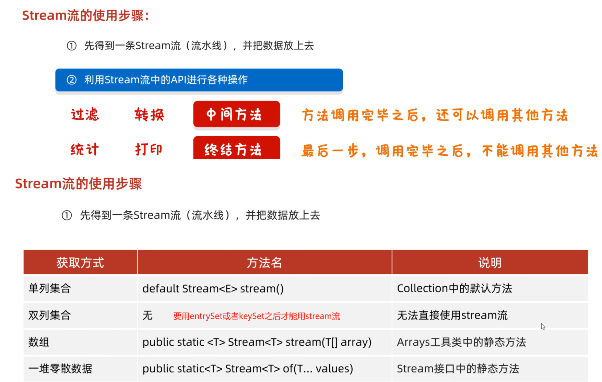

### 创建示例

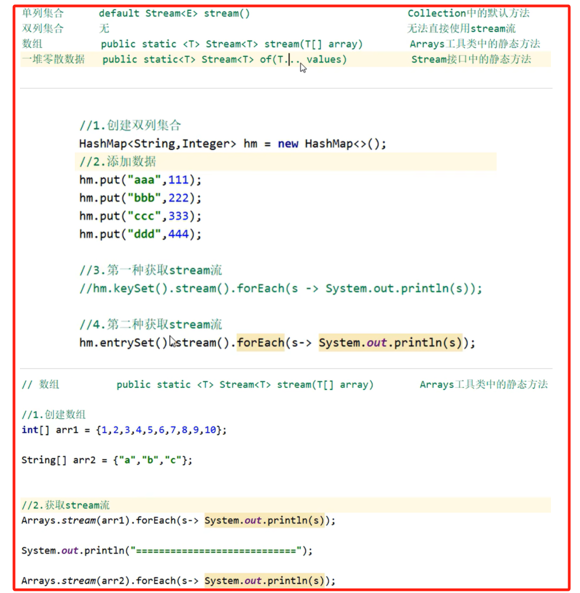

### 小细节

## [2] Stream 流的中间方法

### 方法汇总

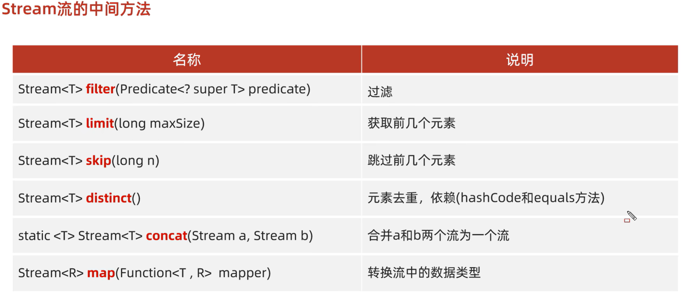

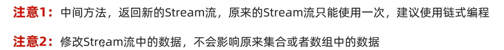

### 过滤方法

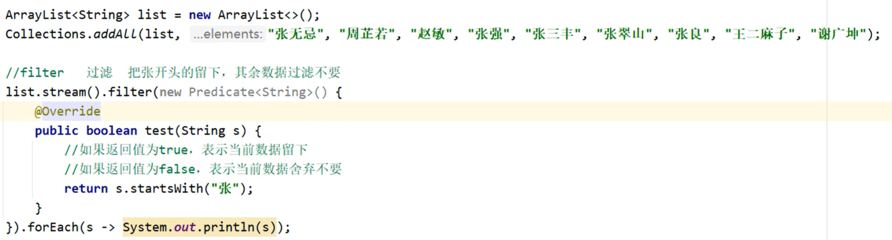

### 注意事项

用过的流不能被再次使用，因为被用过了

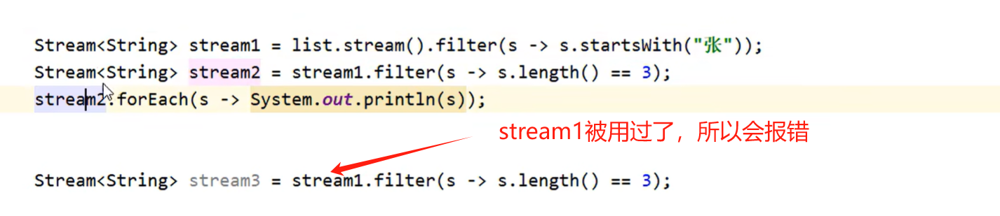

### 获取与跳过

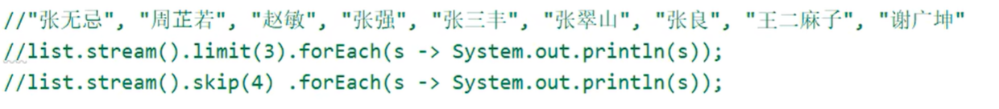

**小练习**

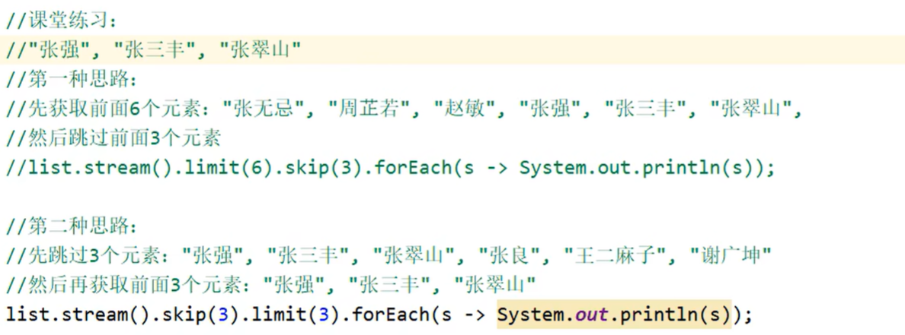

### 数据去重

**Ctrl + B** 跟进源码，会到达 Stream接口

**Ctrl + Alt + B** 是跟进到实现类，因此，我们可以看到其底层实际上是使用了HashSet进行去重的！

### 数据合并

如果类型不同，合并后的类型就是父类类型

### 类型转换

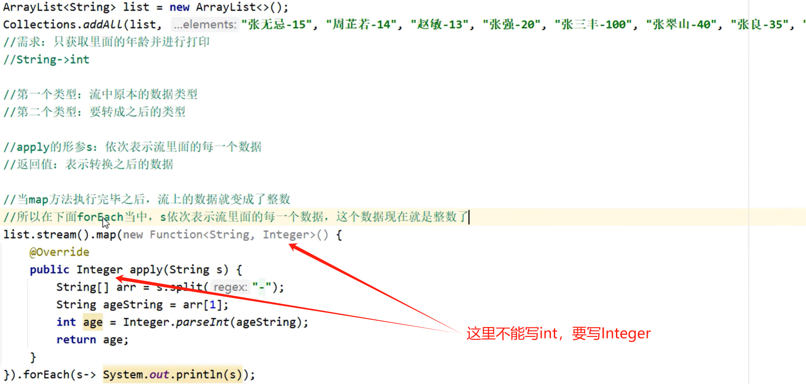

当然也可以是转化为自定义类

## [3] Stream 流的终结方法

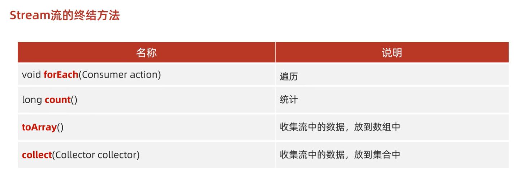

### toArray方法

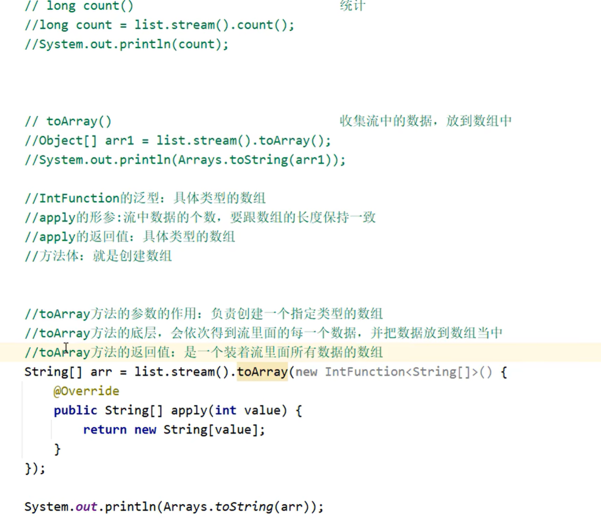

### collect 方法

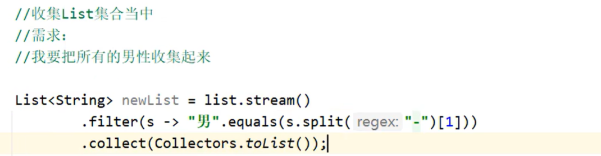

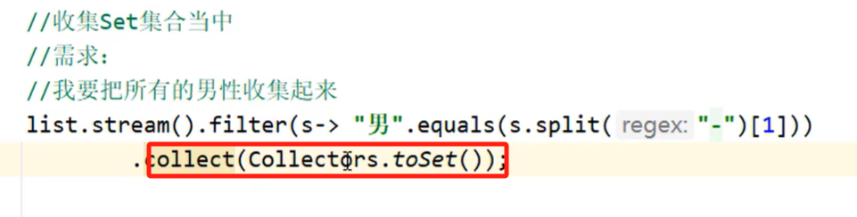

收集到`List`中是会保留重复的元素，反之，`toSet`存到`HashSet`中是不会重复的！

储存为Map...

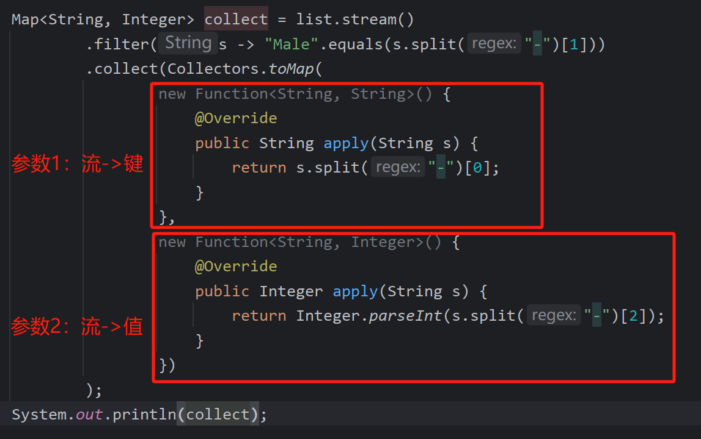

键不允许重复！

当然可以写成lambda表达式

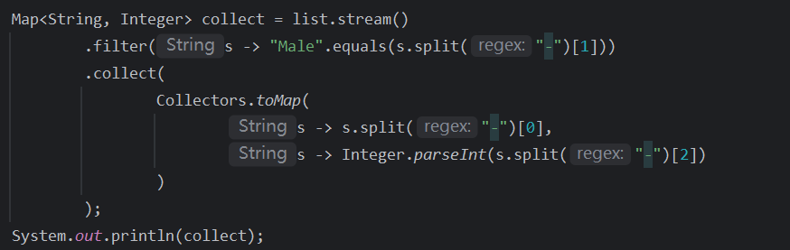

## [4] 总结

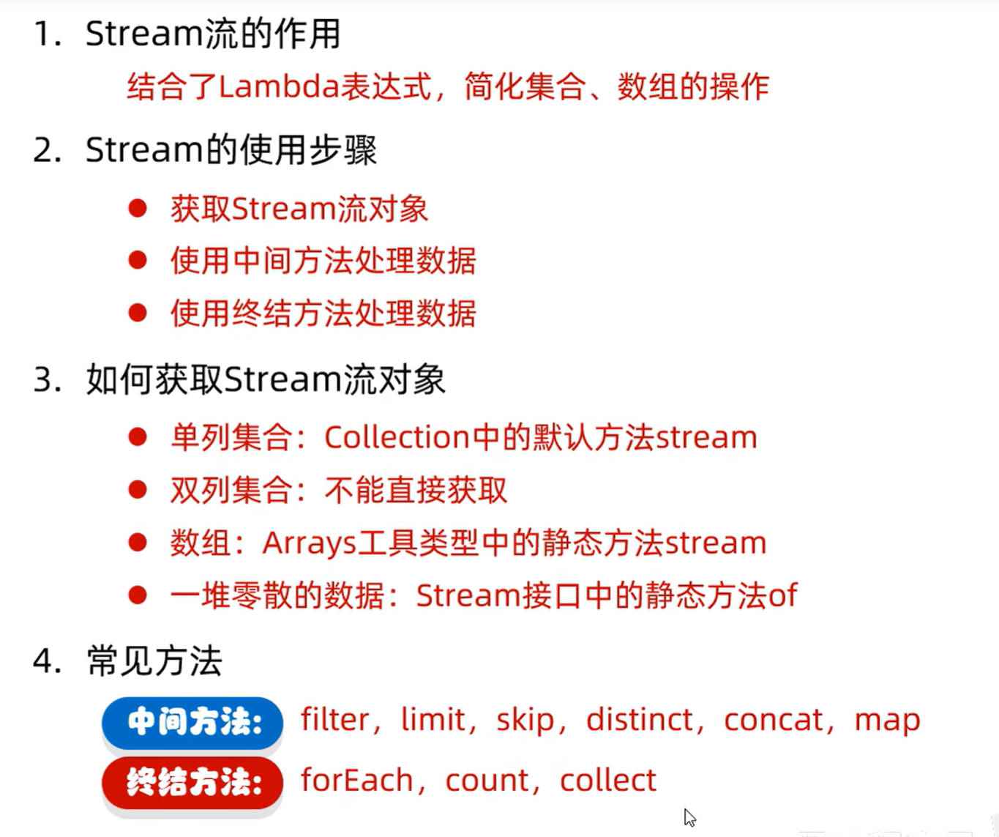
