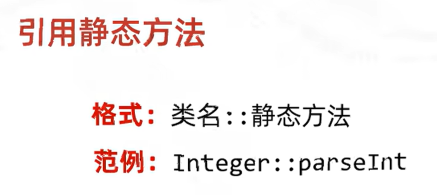

# 方法引用

把已经有的方法拿过来用，当作函数式接口中抽象方法的方法体。


但是不是所有的方法都能引用的！


## 如何引用？


## 引用静态方法



```java
public class test {
    public static void main(String[] args) {
        ArrayList<String> list = new ArrayList<>();
        Collections.addAll(list,"1","2","3","4","5","6","7","8","9");
        
        list.stream().map(test::string2Integer).forEach(System.out::println);
    }
    
    public static Integer string2Integer(String str) {
        return Integer.parseInt(str);
    }
}
```

或者直接：

```java
public class test {
    public static void main(String[] args) {
        ArrayList<String> list = new ArrayList<>();
        Collections.addAll(list,"1","2","3","4","5","6","7","8","9");
        
        list.stream().map(Integer::parseInt).forEach(System.out::println);
    }
}
```


## 引用成员方法


```java
public class test {
    public static void main(String[] args) {
        ArrayList<String> list = new ArrayList<>();
        Collections.addAll(list,"1","2","3","4","5","6","7","8","9");
        
        list.stream().map(new Tools()::string2Integer).forEach(System.out::println);
    }
}
```

## 引用构造方法

在`Student`类中我们需要添加构造方法：

```java
public Student(String text){
    this.name = text.split(",")[0];
    this.age = Integer.parseInt(text.split(",")[1]);
}
```


```java
public class test {
    public static void main(String[] args) {
        ArrayList<String> list = new ArrayList<>();
        list.add("zhangsan,23");
        list.add("lisi,24");
        list.add("wangwu,25");
        list.add("zhaoliu,26");

        list.stream().map(Student::new).forEach(System.out::println);
    }
}
```

## 引用其他方法

### 类名引用成员方法

`类名：：成员方法`

方法引用的规则:

1.需要有函数式接口

2.被引用的方法必须已经存在

3.被引用方法的形参，需要跟抽象方法的第二个形参到最后一个形参保持一致，返回值需要保持一致。

4.被引用方法的功能需要满足当前的需求

- 抽象方法形参的详解:

  **第一个参数**表示流里面的每一个数据。

- **第二个参数到最后一个参数**跟被引用方法的形参保持一致，==如果没有第二个参数==，说明被引用的方法需要是无参的成员方法

**例如**

```java
list.stream().map(String::toUpperCase).forEach(System.out::println);
```

对于流中的每一个方法，我们指定为String类（第一个参数String：：），然后通过这个String类的方法`toUpperCase` ，它返回什么，就是什么，就转化为什么...

**例如**

```java
list.stream().map(Student::student2String).forEach(System.out::println);
```

然后Student类中

```java
public String student2String(){
    return this.name+","+this.age;
}
```

### 引用数组的构造方法


```java
list.stream().toArray(Integer[]::new)
```

数组的类型需要和流中的类型保持一致

```java
Student[] array = list.stream().toArray(Student[]::new);
```

## 总结


