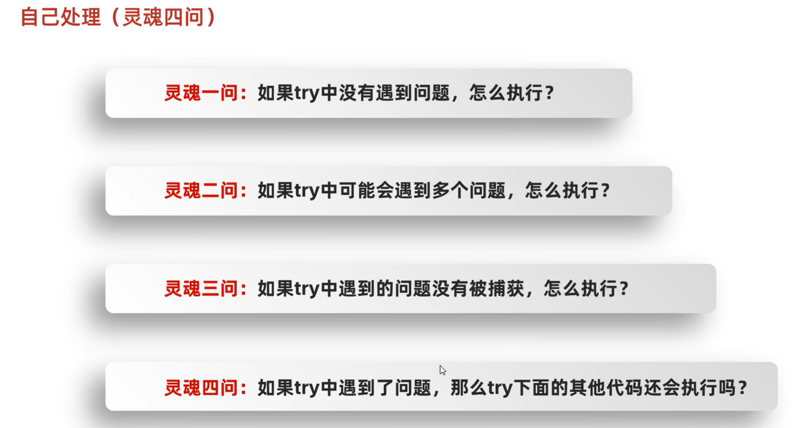

# 异常

> **选中代码，Ctrl+Alt+T 可以快速 try-catch**

异常代表程序出现的问题。我们要学习当程序出现异常后，如何正确处理异常

异常体系最上层的父类是`Exception`

## [1] Error

## [2] Exception 异常

## [3] 编译时异常和运行时异常

也就是说，除了`RuntimeException`和他的子类，其他都是编译时异常！统称**其他异常**或者编译时异常。

## [4] 异常的作用

## [5] JVM虚拟机处理异常默认方案

## [6] 手动捕获异常

目的：当程序出现异常，能够手动处理，不必停止虚拟机

## [7] 捕获多个异常

如果捕获的异常中有父子类关系，父类一定要写在下面。

（类似多态，如果Exception e 写在最上面，那么所有异常都会被Exception e 捕获，从而下面的代码不会运行）

在JDK7之后，我们可以在catch中同时捕获多个异常，中间用`|`进行隔开表示如果出现了A异常或者B异常的话，采取同一种处理方案

如果try中遇到问题，会直接跳转对应的`catch`！如果没有对应的`catch`与之匹配，那么就会交给JVM处理。

## [8] Throwable 成员方法

## [9] 抛出异常

## [10] 自定义异常

