# File

## 路径


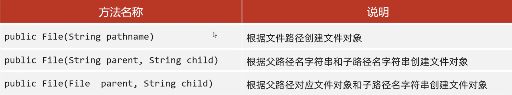

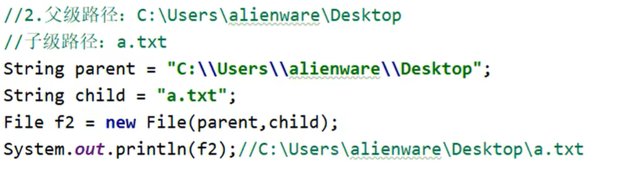

不要使用自己拼接，请使用Java提供的`File(String parent, String child)`拼接

Windows操作系统是`\`但是Linux操作系统是`/`因此Java底层会判断。

## 文件判断和获取

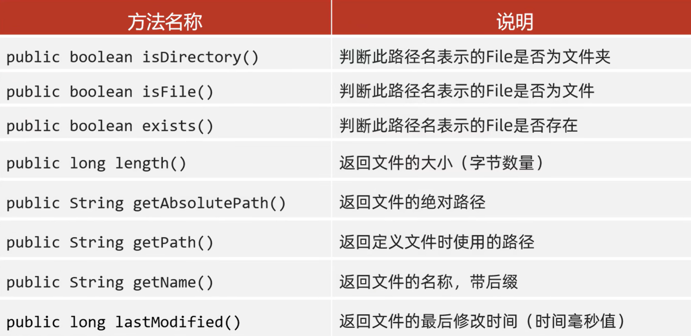

### length() 小细节

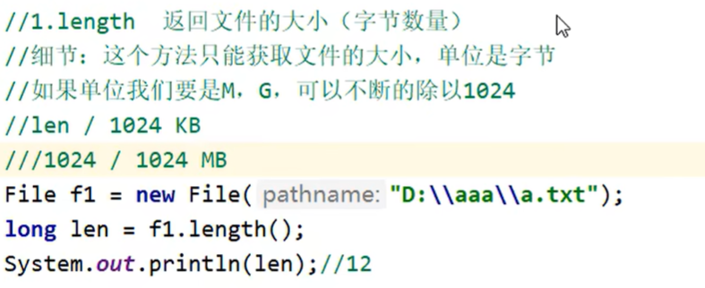

length() 无法获取文件夹大小，如果强行获取，有些系统返回0，有些系统返回4096，但这些都是错误的！

如果要获取文件夹的大小，就需要遍历这个文件夹累加所有文件的大小

### getName() 小细节

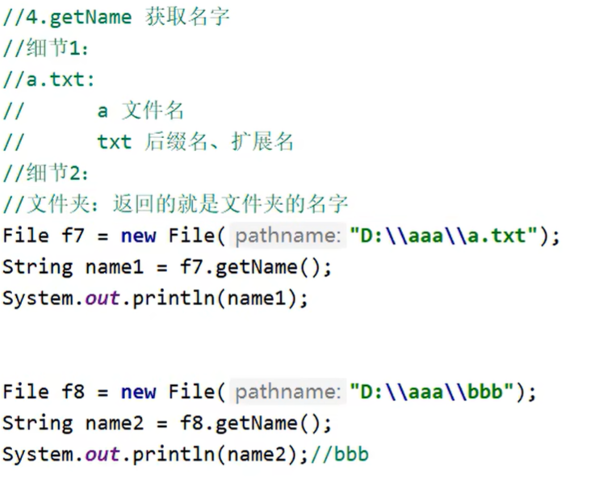


## 文件创建和删除

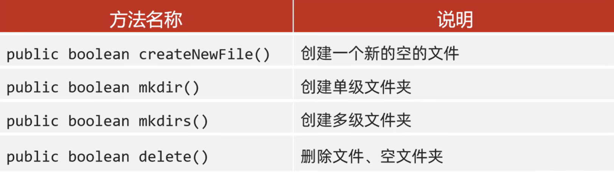

delete方法不走回收站，删除了就没了

### createNewFile 方法

`createNewFile()`方法如果创建成功返回true，反之返回false并且不会报错

如果父级路径不存在，那么就会直接报错`IOException`

这个方法必然创建文件，**而非文件夹！**当然如果你没写后缀它创建出来的就是空白文件（不带后缀）的文件了。

### mkdir 方法

文件夹也叫做目录，directory

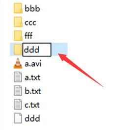 Windows系统下，**不允许文件夹的名字和无后缀文件重名**

因此，Java也同样无法创建

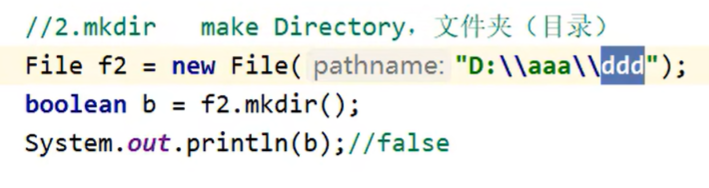


细节1：Windows下路径唯一！如果当前路径存在，那么就创建（文件夹）失败。

细节2：该方法只能创建单级文件夹，而不能创建多级文件夹。

如果需要创建多级文件夹，请使用`mkdirs()`

当然`mkdirs()`也能创建单级文件夹

### delete方法

delete方法能够删除文件、空文件夹。但是如果一个文件夹里面有元素（这里的元素指的是任何东西），就无法删除。

## 获取并遍历

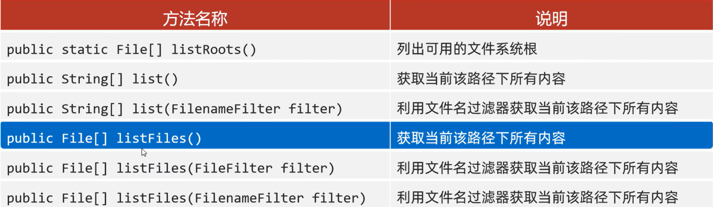

只要掌握蓝色的

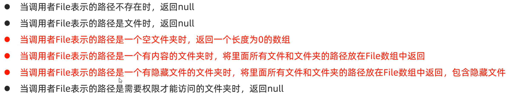

 考虑这样一个文件夹......

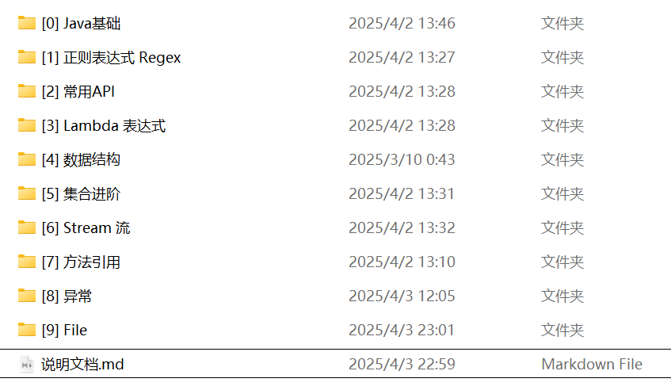

```java
System.out.println(Arrays.toString(File.listRoots()));
// 输出：[C:\, D:\, E:\]
```

```java
System.out.println(Arrays.toString(file.list()));
// 获取当前路径下第一层文件的名称(不打开文件夹)
// 输出：[desktop.ini, [0] Java基础, ..., [9] File, 说明文档.md]
```

```java
System.out.println(Arrays.toString(file.list(new FilenameFilter() {
            @Override
            public boolean accept(File dir, String name) {
                return name.endsWith(".md");
            }
        })));
// 获取当前路径下第一层文件的名称(不打开文件夹)。其次，自定义过滤内容
// 输出：[说明文档.md]
```

```java
System.out.println(Arrays.toString(file.listFiles()));
// 获取当前路径下第一层文件的路径！(不打开文件夹)
// 输出：
// [C:\Users\admin\Desktop\Desktop\Java线上学习\desktop.ini, ... , C:\Users\admin\Desktop\Desktop\Java线上学习\说明文档.md]
```

```java
System.out.println(Arrays.toString(file.listFiles(new FilenameFilter() {
            @Override
            public boolean accept(File dir, String name) {
                return name.endsWith(".md");
            }
        })));
// 获取当前路径下第一层文件的路径！(不打开文件夹)。其次，自定义过滤内容
// 输出：
// [C:\Users\admin\Desktop\Desktop\Java线上学习\说明文档.md]
```


